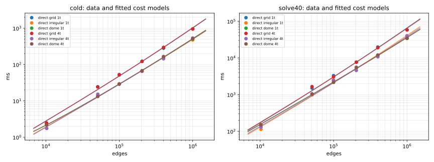

# Crossover analysis — `linux-intel-xeon-4c-16gb`

Source: `benchmarks/results/linux-intel-xeon-4c-16gb/20260918-c4d4208/runs.jsonl`. Models of §5.3 (Stage B) fitted by least squares on log-scaled data; residuals are relative errors of the fit against the per-cell medians. Direct: `t = a·n^1.5 + b·n·log n + c`; iterative: `t = (d + e·iters)·n + f`. Times in ms, `n` = edges.

Only the `direct` backend is present in this data set, so no crossover can be solved; the direct cost model and its residuals are reported for each fixture class and thread setting. `warm_2pct` equals `cold` for the direct backend (a refactorisation does not warm-start).

## Crossover (headline)

| fixture | threads | metric | crossover edges | 90% interval | iterative backend |
|---|---:|---|---:|---|---|
| grid | 4 | cold | n/a (no iterative data) | — | — |
| grid | 4 | warm_2pct | n/a (no iterative data) | — | — |
| grid | 4 | solve40 | n/a (no iterative data) | — | — |
| irregular | 4 | cold | n/a (no iterative data) | — | — |
| irregular | 4 | warm_2pct | n/a (no iterative data) | — | — |
| irregular | 4 | solve40 | n/a (no iterative data) | — | — |
| dome | 4 | cold | n/a (no iterative data) | — | — |
| dome | 4 | warm_2pct | n/a (no iterative data) | — | — |
| dome | 4 | solve40 | n/a (no iterative data) | — | — |

## Fits at 1 thread(s)

### grid

**cold** — per-evaluation time, ms (median of the timed evaluations)

direct fit: a = 6.980e-07, b = 2.258e-05, c = 3.585e-25; RMS relative residual 10.1%, max 16.2% (exceeds 15%).

| edges | observed ms | fitted ms | residual |
|---:|---:|---:|---:|
| 10,224 | 2.46 | 2.85 | +16.2% |
| 50,880 | 24.2 | 20.5 | -15.5% |
| 99,904 | 51.4 | 48.0 | -6.7% |
| 204,160 | 123 | 121 | -1.9% |
| 400,512 | 281 | 294 | +4.6% |
| 1,001,112 | 950 | 1011 | +6.4% |

**warm_2pct** — per-evaluation time after a 2% q step, ms (direct backend: same as cold)

Direct only: identical to `cold` (no warm start in a refactorisation).

**solve40** — full solve extrapolated to 40 L-BFGS-B iterations, ms

direct fit: a = 4.801e-05, b = 1.318e-03, c = 5.375e-20; RMS relative residual 11.6%, max 17.3% (exceeds 15%).

| edges | observed ms | fitted ms | residual |
|---:|---:|---:|---:|
| 10,224 | 148 | 174 | +17.3% |
| 50,880 | 1503 | 1278 | -15.0% |
| 99,904 | 3299 | 3032 | -8.1% |
| 204,160 | 7699 | 7720 | +0.3% |
| 400,512 | 19,874 | 18,981 | -4.5% |
| 1,001,112 | 58,218 | 66,327 | +13.9% |

### irregular

**cold** — per-evaluation time, ms (median of the timed evaluations)

direct fit: a = 2.422e-07, b = 1.820e-05, c = 7.509e-28; RMS relative residual 7.9%, max 13.9% (ok).

| edges | observed ms | fitted ms | residual |
|---:|---:|---:|---:|
| 10,268 | 1.76 | 1.98 | +12.6% |
| 51,052 | 14.9 | 12.9 | -13.9% |
| 99,695 | 29.1 | 28.5 | -1.9% |
| 203,888 | 66.5 | 67.7 | +1.8% |
| 400,357 | 157 | 155 | -0.7% |
| 997,990 | 473 | 492 | +4.1% |

**warm_2pct** — per-evaluation time after a 2% q step, ms (direct backend: same as cold)

Direct only: identical to `cold` (no warm start in a refactorisation).

**solve40** — full solve extrapolated to 40 L-BFGS-B iterations, ms

direct fit: a = 2.551e-05, b = 1.133e-03, c = 7.424e-25; RMS relative residual 11.9%, max 18.1% (exceeds 15%).

| edges | observed ms | fitted ms | residual |
|---:|---:|---:|---:|
| 10,268 | 113 | 134 | +18.1% |
| 51,052 | 987 | 922 | -6.7% |
| 99,695 | 2533 | 2104 | -17.0% |
| 203,888 | 5544 | 5174 | -6.7% |
| 400,357 | 11,548 | 12,317 | +6.7% |
| 997,990 | 37,420 | 41,061 | +9.7% |

### dome

**cold** — per-evaluation time, ms (median of the timed evaluations)

direct fit: a = 2.499e-07, b = 1.803e-05, c = 2.335e-01; RMS relative residual 0.9%, max 1.5% (ok).

| edges | observed ms | fitted ms | residual |
|---:|---:|---:|---:|
| 10,224 | 2.19 | 2.19 | +0.2% |
| 50,880 | 13.2 | 13.0 | -1.3% |
| 99,904 | 28.8 | 28.9 | +0.3% |
| 204,160 | 67.3 | 68.3 | +1.5% |
| 400,512 | 157 | 157 | -0.1% |
| 1,001,112 | 503 | 500 | -0.6% |

**warm_2pct** — per-evaluation time after a 2% q step, ms (direct backend: same as cold)

Direct only: identical to `cold` (no warm start in a refactorisation).

**solve40** — full solve extrapolated to 40 L-BFGS-B iterations, ms

direct fit: a = 1.520e-05, b = 1.486e-03, c = 9.069e-16; RMS relative residual 3.7%, max 5.0% (ok).

| edges | observed ms | fitted ms | residual |
|---:|---:|---:|---:|
| 10,224 | 149 | 156 | +5.0% |
| 50,880 | 1032 | 994 | -3.7% |
| 99,904 | 2170 | 2189 | +0.8% |
| 204,160 | 5293 | 5111 | -3.4% |
| 400,512 | 11,881 | 11,529 | -3.0% |
| 1,001,112 | 34,168 | 35,775 | +4.7% |

## Fits at 4 thread(s)

### grid

**cold** — per-evaluation time, ms (median of the timed evaluations)

direct fit: a = 7.215e-07, b = 2.235e-05, c = 4.916e-25; RMS relative residual 10.4%, max 16.5% (exceeds 15%).

| edges | observed ms | fitted ms | residual |
|---:|---:|---:|---:|
| 10,224 | 2.45 | 2.86 | +16.5% |
| 50,880 | 24.3 | 20.6 | -15.0% |
| 99,904 | 52.8 | 48.5 | -8.2% |
| 204,160 | 122 | 122 | +0.5% |
| 400,512 | 296 | 298 | +0.7% |
| 1,001,112 | 948 | 1032 | +8.8% |

**warm_2pct** — per-evaluation time after a 2% q step, ms (direct backend: same as cold)

Direct only: identical to `cold` (no warm start in a refactorisation).

**solve40** — full solve extrapolated to 40 L-BFGS-B iterations, ms

direct fit: a = 4.503e-05, b = 1.407e-03, c = 1.046e-23; RMS relative residual 12.8%, max 21.8% (exceeds 15%).

| edges | observed ms | fitted ms | residual |
|---:|---:|---:|---:|
| 10,224 | 150 | 179 | +19.6% |
| 50,880 | 1653 | 1292 | -21.8% |
| 99,904 | 3080 | 3040 | -1.3% |
| 204,160 | 7674 | 7666 | -0.1% |
| 400,512 | 19,042 | 18,683 | -1.9% |
| 1,001,112 | 58,366 | 64,566 | +10.6% |

### irregular

**cold** — per-evaluation time, ms (median of the timed evaluations)

direct fit: a = 2.717e-07, b = 1.732e-05, c = 1.074e-17; RMS relative residual 9.4%, max 16.5% (exceeds 15%).

| edges | observed ms | fitted ms | residual |
|---:|---:|---:|---:|
| 10,268 | 1.75 | 1.93 | +10.2% |
| 51,052 | 15.2 | 12.7 | -16.5% |
| 99,695 | 28.9 | 28.4 | -1.6% |
| 203,888 | 64.8 | 68.2 | +5.2% |
| 400,357 | 144 | 158 | +10.0% |
| 997,990 | 534 | 510 | -4.6% |

**warm_2pct** — per-evaluation time after a 2% q step, ms (direct backend: same as cold)

Direct only: identical to `cold` (no warm start in a refactorisation).

**solve40** — full solve extrapolated to 40 L-BFGS-B iterations, ms

direct fit: a = 2.088e-05, b = 1.263e-03, c = 1.617e-18; RMS relative residual 9.8%, max 14.3% (ok).

| edges | observed ms | fitted ms | residual |
|---:|---:|---:|---:|
| 10,268 | 131 | 142 | +8.1% |
| 51,052 | 1012 | 940 | -7.1% |
| 99,695 | 2458 | 2107 | -14.3% |
| 203,888 | 4565 | 5071 | +11.1% |
| 400,357 | 10,726 | 11,813 | +10.1% |
| 997,990 | 40,247 | 38,230 | -5.0% |

### dome

**cold** — per-evaluation time, ms (median of the timed evaluations)

direct fit: a = 2.709e-07, b = 1.773e-05, c = 2.171e-01; RMS relative residual 2.1%, max 4.0% (ok).

| edges | observed ms | fitted ms | residual |
|---:|---:|---:|---:|
| 10,224 | 2.17 | 2.17 | +0.1% |
| 50,880 | 13.2 | 13.1 | -1.1% |
| 99,904 | 29.2 | 29.2 | -0.3% |
| 204,160 | 66.8 | 69.5 | +4.0% |
| 400,512 | 166 | 160 | -3.1% |
| 1,001,112 | 514 | 517 | +0.5% |

**warm_2pct** — per-evaluation time after a 2% q step, ms (direct backend: same as cold)

Direct only: identical to `cold` (no warm start in a refactorisation).

**solve40** — full solve extrapolated to 40 L-BFGS-B iterations, ms

direct fit: a = 1.528e-05, b = 1.514e-03, c = 7.365e-16; RMS relative residual 4.7%, max 6.3% (ok).

| edges | observed ms | fitted ms | residual |
|---:|---:|---:|---:|
| 10,224 | 150 | 159 | +5.6% |
| 50,880 | 1050 | 1010 | -3.7% |
| 99,904 | 2179 | 2224 | +2.1% |
| 204,160 | 5541 | 5190 | -6.3% |
| 400,512 | 12,016 | 11,697 | -2.7% |
| 1,001,112 | 34,292 | 36,253 | +5.7% |

