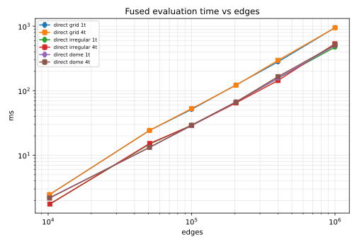
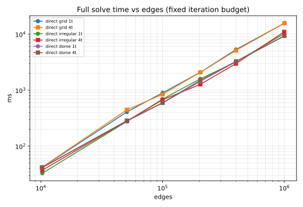

# Benchmark sweep — `linux-intel-xeon-4c-16gb` — 20260918

Raw data: `benchmarks/results/linux-intel-xeon-4c-16gb/20260918-c4d4208/runs.jsonl` (36 cells, 79 completed records, 0 not completed). Git: `c4d42089ca5020c8a4aace94601d08c8489d5823`.

43 record(s) are re-runs of cells that had been disturbed by other load on the machine; for each such cell the tables and fits use the run that is not flagged (IQR ≤ 10% of the median) with the smallest evaluation median (`runs` column). All records remain in `runs.jsonl`.

## Machine

* OS: Linux-6.12.94+-x86_64-with-glibc2.39
* CPU: Intel(R) Xeon(R) Processor — 4 logical / 4 physical cores
* RAM: 16 GiB
* GPU adapters: none discovered
* Rust: rustc 1.89.0 (29483883e 2025-08-04)

## Configuration

4 passes were run into this results directory (later passes re-measure cells disturbed by other load; see the selection rule above).

Pass 1: `{"sizes": [72, 160, 224, 320, 448, 708], "fixtures": ["grid", "irregular", "dome"], "threads": [1, 4], "reps": 5, "iters": 10, "solvers": ["direct"], "wall_cap_s": 600, "warmup": true, "started_utc": "2026-09-18T14:49:33Z"}`

Pass 2: `{"sizes": [72, 160, 224, 320, 448, 708], "fixtures": ["grid", "irregular", "dome"], "threads": [1, 4], "reps": 5, "iters": 10, "solvers": ["direct"], "wall_cap_s": 600, "warmup": true, "started_utc": "2026-09-18T14:59:49Z"}`

Pass 3: `{"sizes": [72, 160, 224, 320, 448, 708], "fixtures": ["dome"], "threads": [1], "reps": 5, "iters": 10, "solvers": ["direct"], "wall_cap_s": 600, "warmup": true, "started_utc": "2026-09-18T15:09:07Z"}`

Pass 4: `{"sizes": [708], "fixtures": ["grid"], "threads": [1], "reps": 5, "iters": 10, "solvers": ["direct"], "wall_cap_s": 600, "warmup": true, "started_utc": "2026-09-18T15:10:46Z"}`

## Protocol

Release build (`--locked`). One process per cell. The harness performs the cache setup and first factorisation (`setup ms`), discards one fused evaluation, times `reps` evaluations (`eval ms`: median ± interquartile range; ` !` flags cells whose IQR exceeds 10% of the median), then runs one full L-BFGS-B solve with a fixed iteration budget and tolerances set to zero (`total ms`, box bounds `[0.1, 10]`, start `q = 1`). Non-grid fixtures are generated at the edge count of the grid of the same `grid` column. `threads` is `RAYON_NUM_THREADS`. Peak RSS is `VmHWM` of the cell's process.

## Notes

* Shared 4-vCPU cloud VM (no CPU governor exposed). Another agent's single-threaded
  process ran at 100% of one core for most of the sweep and compiled with all cores
  at times; passes 2–4 re-measured cells, and the selection rule above picks the
  least-disturbed run per cell. The grid 708 (1M edges) single-thread evaluation is
  950 ms here against 877 ms in `BENCHMARKS.md` measured on an idle VM.
* 1 and 4 threads give the same times to within noise: the numeric factorisation
  (~75% of an evaluation) runs single-threaded (`Parallelism::None`, see
  `BENCHMARKS.md`), so `RAYON_NUM_THREADS` only touches the O(ne) loops.
* Irregular and dome fixtures at matched edge counts have 0.5–0.6× the free nodes of
  the grid (higher node degree), hence smaller factors and 1.6–1.9× faster evaluations.
* Fits: RMS relative residuals are below 15% in every cell; the maximum residual
  exceeds 15% only at 10k–50k edges on the grid and irregular fixtures, where the
  10k-edge evaluation is faster than the `n^1.5 + n log n` trend (the factor fits in
  cache) — the model has no term for that regime.

## Results

### `direct`, 1 thread(s)

| fixture | grid | edges | free nodes | setup ms | eval ms (median ± IQR) | evals | iters | total ms | ms/iter | peak RSS MB | final loss | runs |
|---|---:|---:|---:|---:|---:|---:|---:|---:|---:|---:|---:|---:|
| grid | 72 | 10,224 | 5,180 | 6.22 | 2.46 ± 0.02 | 14 | 10 | 41.8 | 4.18 | 14 | 3.7786e+07 | 2 |
| grid | 160 | 50,880 | 25,596 | 43.8 | 24.2 ± 0.18 | 15 | 10 | 409 | 40.9 | 55 | 6.0680e+09 | 2 |
| grid | 224 | 99,904 | 50,172 | 96.0 | 51.4 ± 0.09 | 14 | 10 | 897 | 89.7 | 119 | 5.0119e+10 | 2 |
| grid | 320 | 204,160 | 102,396 | 218 | 123 ± 1.83 | 15 | 10 | 2088 | 209 | 217 | 4.4367e+11 | 2 |
| grid | 448 | 400,512 | 200,700 | 474 | 281 ± 15.9 | 15 | 10 | 5324 | 532 | 445 | 3.2997e+12 | 2 |
| grid | 708 | 1,001,112 | 501,260 | 1549 | 950 ± 15.9 | 15 | 10 | 15,716 | 1572 | 1087 | 5.2366e+13 | 3 |
| irregular | 72 | 10,268 | 2,809 | 6.01 | 1.76 ± 0.02 | 13 | 10 | 32.9 | 3.29 | 12 | 9.2555e+03 | 2 |
| irregular | 160 | 51,052 | 14,641 | 40.3 | 14.9 ± 0.01 | 15 | 10 | 277 | 27.7 | 47 | 1.6431e+06 | 2 |
| irregular | 224 | 99,695 | 28,900 | 78.0 | 29.1 ± 0.06 | 20 | 10 | 692 | 69.2 | 92 | 1.3492e+07 | 2 |
| irregular | 320 | 203,888 | 59,536 | 276 | 66.5 ± 1.25 | 16 | 10 | 1593 | 159 | 184 | 5.5992e+07 | 2 |
| irregular | 448 | 400,357 | 117,649 | 404 | 157 ± 1.98 | 16 | 10 | 3190 | 319 | 373 | 4.5181e+08 | 2 |
| irregular | 708 | 997,990 | 294,849 | 1184 | 473 ± 8.24 | 17 | 10 | 10,243 | 1024 | 941 | 5.8660e+09 | 2 |
| dome | 72 | 10,224 | 2,521 | 5.34 | 2.19 ± 0.10 | 16 | 10 | 41.1 | 4.11 | 13 | 2.7720e+04 | 3 |
| dome | 160 | 50,880 | 12,641 | 29.9 | 13.2 ± 0.14 | 19 | 10 | 280 | 28.0 | 48 | 1.8367e+06 | 3 |
| dome | 224 | 99,904 | 24,865 | 64.3 | 28.8 ± 0.04 | 18 | 10 | 591 | 59.1 | 94 | 2.7503e+07 | 3 |
| dome | 320 | 204,160 | 50,881 | 150 | 67.3 ± 0.25 | 19 | 10 | 1436 | 144 | 184 | 2.3284e+08 | 3 |
| dome | 448 | 400,512 | 99,905 | 343 | 157 ± 4.95 | 17 | 10 | 3227 | 323 | 376 | 3.2374e+09 | 3 |
| dome | 708 | 1,001,112 | 249,925 | 1026 | 503 ± 3.19 | 16 | 10 | 9312 | 931 | 896 | 2.5787e+10 | 3 |

### `direct`, 4 thread(s)

| fixture | grid | edges | free nodes | setup ms | eval ms (median ± IQR) | evals | iters | total ms | ms/iter | peak RSS MB | final loss | runs |
|---|---:|---:|---:|---:|---:|---:|---:|---:|---:|---:|---:|---:|
| grid | 72 | 10,224 | 5,180 | 6.24 | 2.45 ± 0.00 | 14 | 10 | 42.2 | 4.22 | 14 | 3.7786e+07 | 2 |
| grid | 160 | 50,880 | 25,596 | 43.7 | 24.3 ± 0.13 | 15 | 10 | 446 | 44.6 | 55 | 6.0680e+09 | 2 |
| grid | 224 | 99,904 | 50,172 | 98.2 | 52.8 ± 0.25 | 14 | 10 | 844 | 84.4 | 121 | 5.0119e+10 | 2 |
| grid | 320 | 204,160 | 102,396 | 219 | 122 ± 3.61 | 15 | 10 | 2083 | 208 | 217 | 4.4367e+11 | 2 |
| grid | 448 | 400,512 | 200,700 | 488 | 296 ± 3.64 | 15 | 10 | 5126 | 513 | 445 | 3.2997e+12 | 2 |
| grid | 708 | 1,001,112 | 501,260 | 1526 | 948 ± 2.45 | 15 | 10 | 15,736 | 1574 | 1087 | 5.2366e+13 | 2 |
| irregular | 72 | 10,268 | 2,809 | 5.99 | 1.75 ± 0.01 | 13 | 10 | 37.2 | 3.72 | 12 | 9.2555e+03 | 2 |
| irregular | 160 | 51,052 | 14,641 | 38.6 | 15.2 ± 0.11 | 15 | 10 | 282 | 28.2 | 47 | 1.6431e+06 | 2 |
| irregular | 224 | 99,695 | 28,900 | 77.4 | 28.9 ± 0.14 | 20 | 10 | 672 | 67.2 | 92 | 1.3492e+07 | 2 |
| irregular | 320 | 203,888 | 59,536 | 172 | 64.8 ± 0.43 | 16 | 10 | 1270 | 127 | 184 | 5.5992e+07 | 2 |
| irregular | 448 | 400,357 | 117,649 | 400 | 144 ± 0.30 | 16 | 10 | 2982 | 298 | 362 | 4.5181e+08 | 2 |
| irregular | 708 | 997,990 | 294,849 | 1266 | 534 ± 3.91 | 17 | 10 | 11,011 | 1101 | 941 | 5.8660e+09 | 2 |
| dome | 72 | 10,224 | 2,521 | 5.19 | 2.17 ± 0.06 | 16 | 10 | 41.5 | 4.15 | 13 | 2.7720e+04 | 2 |
| dome | 160 | 50,880 | 12,641 | 30.8 | 13.2 ± 0.13 | 19 | 10 | 285 | 28.5 | 48 | 1.8367e+06 | 2 |
| dome | 224 | 99,904 | 24,865 | 67.4 | 29.2 ± 0.14 | 18 | 10 | 595 | 59.5 | 93 | 2.7503e+07 | 2 |
| dome | 320 | 204,160 | 50,881 | 156 | 66.8 ± 0.85 | 19 | 10 | 1502 | 150 | 184 | 2.3284e+08 | 2 |
| dome | 448 | 400,512 | 99,905 | 353 | 166 ± 4.26 | 17 | 10 | 3269 | 327 | 375 | 3.2374e+09 | 2 |
| dome | 708 | 1,001,112 | 249,925 | 1020 | 514 ± 2.43 | 16 | 10 | 9338 | 934 | 904 | 2.5787e+10 | 2 |

## Plots

## Cost-model fit

Direct model `t = a·n^1.5 + b·n·log n + c` fitted by least squares on log-scaled data, per fixture and thread setting, to the evaluation time (`cold`) and to the full solve extrapolated to 40 iterations (`solve40`). Full details, the iterative models and the crossover search are in `crossover-linux-intel-xeon-4c-16gb.md` (from `scripts/crossover_fit.py`).

| threads | fixture | metric | a | b | c | RMS residual | max residual |
|---:|---|---|---:|---:|---:|---:|---:|
| 1 | grid | cold | 6.980e-07 | 2.258e-05 | 3.585e-25 | 10.1% | 16.2% (> 15%) |
| 1 | grid | solve40 | 4.801e-05 | 1.318e-03 | 5.375e-20 | 11.6% | 17.3% (> 15%) |
| 1 | irregular | cold | 2.422e-07 | 1.820e-05 | 7.509e-28 | 7.9% | 13.9% |
| 1 | irregular | solve40 | 2.551e-05 | 1.133e-03 | 7.424e-25 | 11.9% | 18.1% (> 15%) |
| 1 | dome | cold | 2.499e-07 | 1.803e-05 | 2.335e-01 | 0.9% | 1.5% |
| 1 | dome | solve40 | 1.520e-05 | 1.486e-03 | 9.069e-16 | 3.7% | 5.0% |
| 4 | grid | cold | 7.215e-07 | 2.235e-05 | 4.916e-25 | 10.4% | 16.5% (> 15%) |
| 4 | grid | solve40 | 4.503e-05 | 1.407e-03 | 1.046e-23 | 12.8% | 21.8% (> 15%) |
| 4 | irregular | cold | 2.717e-07 | 1.732e-05 | 1.074e-17 | 9.4% | 16.5% (> 15%) |
| 4 | irregular | solve40 | 2.088e-05 | 1.263e-03 | 1.617e-18 | 9.8% | 14.3% |
| 4 | dome | cold | 2.709e-07 | 1.773e-05 | 2.171e-01 | 2.1% | 4.0% |
| 4 | dome | solve40 | 1.528e-05 | 1.514e-03 | 7.365e-16 | 4.7% | 6.3% |

