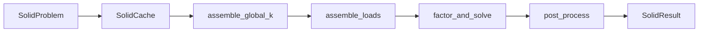

# Continuum FEA Reference (Tet4 Solid Elements)

Reference Rust code for **3D linear continuum FEA** with **4-node tetrahedral (tet4) elements** and **4-point Gauss quadrature**. Intended to be used as input for an LLM or human to generate or extend **Julia FEA solver** code with solid (continuum) elements.

This folder contains code only—no Cargo.toml or build. The Rust files use `crate::` and `theseus::` and depend on types (sparse matrix, factorization, error) from the parent Theseus crate. In Julia you reimplement the **tet definition and assembly math** and plug into your existing sparse solver and DOF handling.

---

## Pipeline (high level)

1. **Build problem**: nodes, elements (tet connectivity), materials (E, ν, density), supports (fixed DOFs per node), loads (point forces). Build **DOF map** (free vs fixed, `global_to_free`, `free_dofs`, `fixed_dofs`).
2. **Build sparsity**: From connectivity and DOF map, build global K sparsity pattern and an **element-to-global scatter map** (for each element: list of (global_nz_index, local_i, local_j) so K_e[li,lj] is added into K at the right position).
3. **Assemble global K**: For each element: get coords, get D for material, compute K_e = Σ w |J| B^T D B over 4 Gauss points, scatter K_e into global K using the scatter map.
4. **Assemble RHS**: Point loads go to free DOF indices; optionally self-weight via N(ξ) at Gauss points, distributed to nodes.
5. **Solve**: Factor and solve K u = f on **free DOFs only** (Julia: use your existing sparse solver).
6. **Post-process**: Build full u (free + fixed); per element at each GP: ε = B u_e, σ = D ε, von Mises; reactions = K u at fixed DOFs minus applied loads.

---

## File guide (symbols and sections)

### solid_assembly.rs — Tet4 definition and assembly

| Section / symbol | Purpose |
|------------------|--------|
| **3×3 helpers** (lines ~16–55) | `det3`, `inv3`, `transpose3` — used for Jacobian in B matrix. |
| `extract_tet_coords` | Node positions for one tet from global `node_positions` and element node list `[usize; 4]`. |
| **4-point Gauss quadrature** (~71–87) | `TET4_GAUSS_POINTS`, `NUM_GP` (4). Reference tetrahedron: (ξ,η,ζ) with weight 1/24 each; formulas in constants. |
| **Shape functions** (~92–107) | `tet4_shape_functions(ξ,η,ζ)` → [N1, N2, N3, N4] = [1−ξ−η−ζ, ξ, η, ζ]. `tet4_shape_derivs` → dN/dξ (constant for linear tet). |
| **Constitutive** (~112–152) | `constitutive_matrix(E, ν)` → 6×6 isotropic D. `precompute_d_matrices(problem)`. `d_times_b(D, B)` → D*B (6×12) using block structure. |
| **B matrix** (~157–211) | `tet4_b_matrix_at(coords, ξ, η, ζ)` → (B 6×12, \|det J\|). Jacobian from coords, dN/dx = J^{-T} dN/dξ, then fill B (ε = B u_e). `tet4_b_matrix(coords)` at centroid (0.25,0.25,0.25). |
| **Element stiffness** (~216–266) | `tet4_element_stiffness_quad(coords, D)` → K_e = Σ w \|J\| B^T D B (12×12). `tet4_element_stiffness(B, D, volume)` single-point (for tests). |
| **Global assembly** (~272–321) | `assemble_global_k(cache, problem)`: per element K_e, then scatter into global K using `element_to_nz.entries[e]` (nz_idx, li, lj). |
| **Load assembly** (~327–358) | `assemble_loads(cache, problem)`: zero RHS, add point loads to free DOFs; if self-weight, integrate at GPs with N and add to RHS. |

### solid_types.rs — Data structures

| Symbol | Purpose |
|--------|--------|
| `SolidMaterial` | e, nu, density, yield_stress. |
| `SolidElementProps` | material_idx per element. |
| `SolidLoad` | node_idx, force [fx,fy,fz]. |
| `SolidSupport` | node_idx, fixed_dofs [bool; 3] (x,y,z). |
| `SolidDofMap` | num_nodes, num_total_dofs, num_free_dofs, num_fixed_dofs, global_to_free (Vec<Option<usize>>), free_dofs, fixed_dofs. `from_supports(num_nodes, supports)` builds it. |
| `SolidElementToNz` | entries: for each element, Vec of (nz_index, local_i, local_j) for scattering K_e into global K. |
| `SolidProblem` | num_nodes, num_elements, materials, element_props, supports, loads, node_positions (n×3), elements (Vec of [node0, node1, node2, node3]), dof_map, include_self_weight, gravity. |
| `SolidCache` | k_matrix (sparse), factorization, element_to_nz, dof_map, displacements (free), rhs, stresses/strains/von_mises per element per GP, reactions. `new(problem)` builds sparsity and element_to_nz (needs sparse from_triplets and find_nz_index). |
| `SolidResult` | displacements (full), deformed_positions, reactions, stresses, strains, von_mises. |

### solid_solve.rs — Forward solve

| Symbol | Purpose |
|--------|--------|
| `factor_and_solve(cache)` | Cholesky with LDL fallback; solve K u = rhs; write solution to cache.displacements. |
| `post_process(cache, problem, u_full)` | Per element: B at each GP, ε = B u_e, σ = D ε, von Mises; K_e u_e for reaction contribution; scatter to cache; subtract applied loads and self-weight from reactions; zero reactions at free DOFs. |
| `solve_solid(cache, problem)` | Entry: assemble_global_k → assemble_loads → factor_and_solve → build u_full → post_process → deformed positions → return SolidResult. |

### solid_cantilever_sanity.rs — Example usage

Single **skewed tet**: 4 nodes, one element [0,1,2,3]. Nodes 0,1,2 fixed (SolidSupport); node 3 loaded with (0, 0, -1000). Build `SolidProblem` (with `SolidDofMap::from_supports(4, &supports)`), `SolidCache::new(&problem)`, `solve_solid(&mut cache, &problem)`. Checks: sum of z-reactions ≈ 1000; node 3 displaces downward; von Mises finite. Use this to infer API shape (problem → cache → solve) when porting to Julia.

---

## Julia translation notes

- **Data structures**: `SolidDofMap.global_to_free`, `free_dofs`, `fixed_dofs` map directly to Julia (vectors, maybe 1-based). Same idea for `SolidElementToNz`: per element, list of (global K index, local i, local j) for scatter.
- **Sparse K**: This code uses CSC (col_ptrs, row_indices, values). In Julia you can keep your existing sparse format (e.g. `SparseArrays`) and only need a way to scatter K_e into K (e.g. global DOF indices and a function that adds into the right entries).
- **Port the math**: Copy the tet4 formulas: Gauss points and weights, shape functions and derivs, Jacobian and B matrix, isotropic D, K_e = Σ w |J| B^T D B, and RHS for self-weight (N at GP). Factor/solve can stay your existing linear solver.
- **Strain ordering**: This code uses Voigt order for 6-vectors: [εxx, εyy, εzz, γxy, γyz, γxz] (and same for σ). Von Mises: 0.5*((σxx-σyy)² + (σyy-σzz)² + (σzz-σxx)² + 6*(σxy²+σyz²+σxz²)) then sqrt.
- **Reference tet**: Vertices (0,0,0), (1,0,0), (0,1,0), (0,0,1). Parametric coords ξ, η, ζ. Volume of ref tet = 1/6; four GP weights sum to 1/6.

---

## Quick symbol map (for LLM)

| Concept | Rust symbol |
|--------|-------------|
| Tet shape functions | `tet4_shape_functions`, `tet4_shape_derivs` |
| Gauss points (tet4) | `TET4_GAUSS_POINTS`, `NUM_GP` |
| Strain–displacement matrix | `tet4_b_matrix_at`, `tet4_b_matrix` |
| Constitutive matrix (isotropic) | `constitutive_matrix`, `precompute_d_matrices`, `d_times_b` |
| Element stiffness | `tet4_element_stiffness_quad` |
| Global K assembly | `assemble_global_k` |
| RHS / load assembly | `assemble_loads` |
| DOF map (free/fixed) | `SolidDofMap`, `from_supports`, `global_to_free` |
| Element → global scatter | `SolidElementToNz.entries[e]` → (nz_idx, li, lj) |
| Full solve | `solve_solid` |
