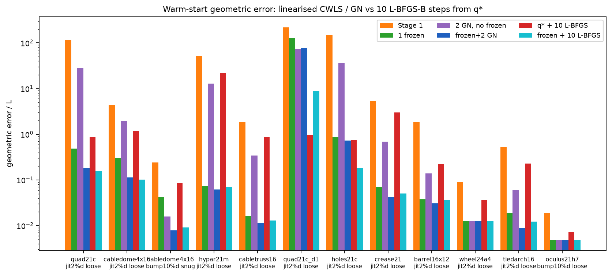
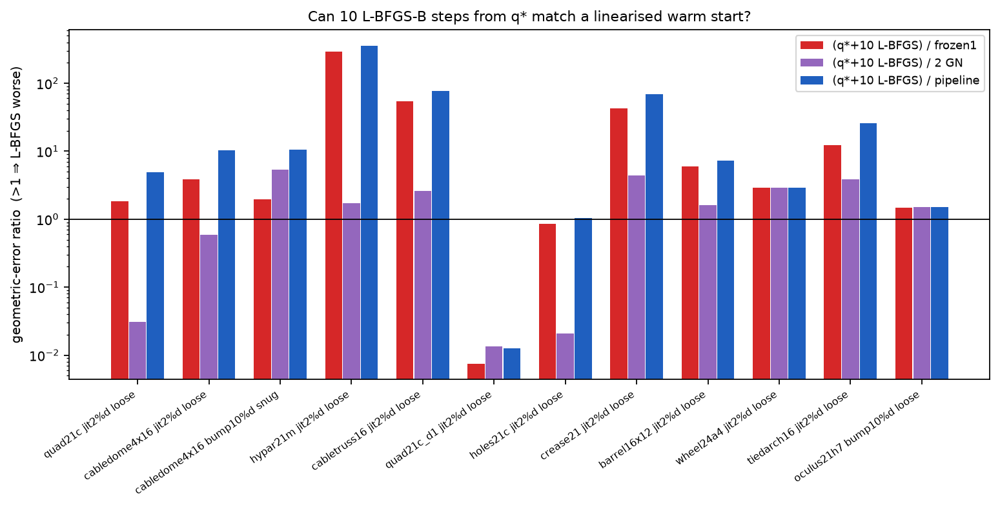
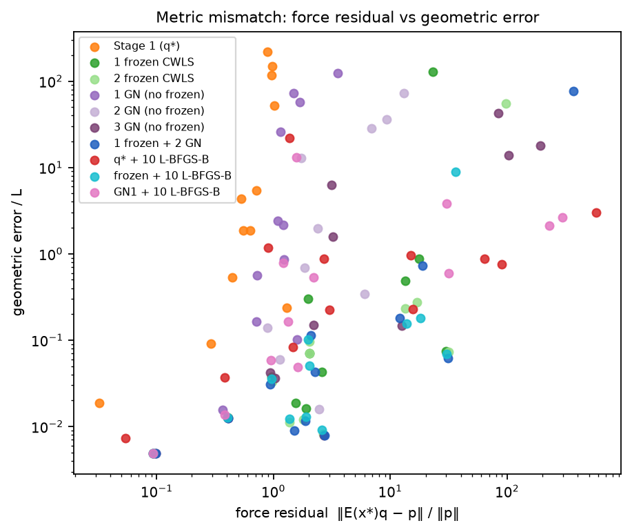
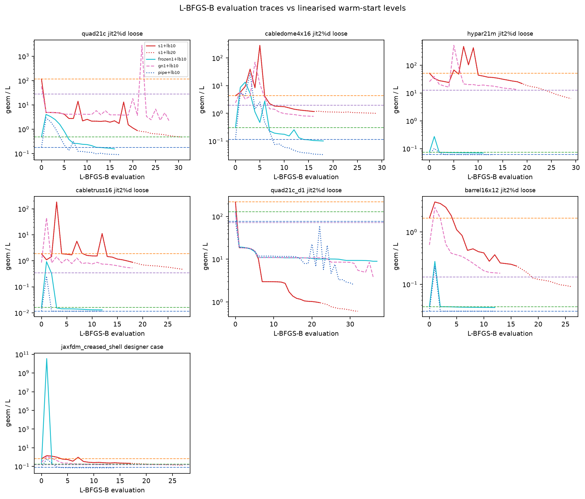
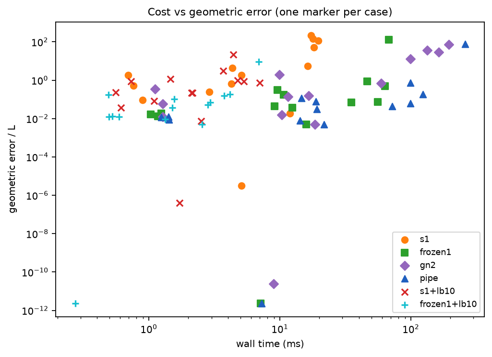

# Frozen CWLS / Gauss–Newton versus short L-BFGS-B from `q*`

This note answers a concrete question about the Stage-2 warm start in
[`warm_start.md`](warm_start.md): after the Stage-1 force-residual particular
`q*` — which can sit at a *large* geometric residual — is a handful of
compliance-weighted linearisations worth the cost, or does handing `q*` to
L-BFGS-B on the exact target-geometry objective close the same gap in ten
accepted steps (enough to fill the compact BFGS history)?

The numerical evidence is produced by

```bash
cargo run --release -p theseus --example warm_start_bench -- tradeoff bench/figures/data
cd bench/figures && uv run render_tradeoff.py
```

and lives in [`bench/figures/data/tradeoff.json`](../bench/figures/data/tradeoff.json).
Figures are under [`figures/`](figures/). The run also includes jax-fdm's
creased-shell case (exact + designer) when the exported JSON is present.
Seed guard is **off** for every controlled linearisation so every method
starts from the same `q*`; the production pipeline with the guard is
reported as `pipe_guard` only.

---

## 1. Three maps of the same residual

The forward force-density solve `D(q) x(q) = p − D_f(q) x_f` and the
equilibrium identity `E(x*) q = D(q) x* + D_f(q) x_f` give

```
r(q)  := E(x*) q − p                 (affine in q)
x(q) − x* = − D(q)⁻¹ r(q)            (exact for geometry-independent loads)
```

so the geometric residual *is* the force residual seen through the current
compliance. Differentiating the implicit residual `D(q) x + D_f(q) x_f − p = 0`
produces the true Jacobian of the forward map:

```
J(q) := ∂x/∂q = − D(q)⁻¹ E(x(q)).
```

`E` is assembled on the *current* edge directions `C_n x(q) + C_f x_f`. The
identity residual uses `E(x*)`. Those two matrices agree if and only if
`x(q) = x*`.

The geometric objective L-BFGS-B actually minimises is

```
f(q) = ½ ‖x(q) − x*‖² = ½ ‖D(q)⁻¹ r(q)‖².
```

Its gradient (the adjoint already implemented in Theseus) is exact:

```
∇f(q) = J(q)ᵀ (x(q) − x*)
      = E(x(q))ᵀ D(q)⁻ᵀ D(q)⁻¹ r(q)
      = E(x(q))ᵀ D(q)⁻² r(q).
```

Three first-order models of a step `q_k + Δ` now sit on the table.

### 1.1 Stage 1 — Euclidean force residual

```
q* = arg min  ‖E(x*) q − p‖²    s.t.  lo ≤ q ≤ hi.
```

This is the correct *pattern* of `q` (and the only cheap place the self-stress
of a self-tied net can be recovered), but it is the wrong *metric*. Nodes that
`D(q)` treats as soft are under-weighted; the shallow vertical rows of `E(x*)`
are almost invisible. The geometric error at `q*` is `‖D(q*)⁻¹ r(q*)‖`, which
can be orders of magnitude larger than `‖r(q*)‖` suggests.

### 1.2 Frozen CWLS — Gauss–Newton with `E` held at the target

Hold `D` at `q_k` and `E` at `x*`:

```
x(q_k + Δ) − x*  ≈  − D(q_k)⁻¹ ( r(q_k) + E(x*) Δ ).
```

The boxed least-squares problem in `Δ` is a sparse saddle. It is *exactly*
Stage 1 with the norm changed from `I` to `D(q_k)⁻²`. Because the identity
uses `E(x*)`, this linearisation is the derivative of the identity residual
with the metric frozen — not the derivative of `x(q)`. When `x(q*)` is
collapsed, `E(x*)` still has the target's well-shaped edge directions, which
is why one frozen step can rescue a seed that the true Jacobian at `x(q*)`
cannot.

### 1.3 Gauss–Newton — the true first-order model of `x(q)`

```
x(q_k + Δ) − x*  ≈  − D(q_k)⁻¹ ( r(q_k) + E(x(q_k)) Δ )
                 =  e_k + J(q_k) Δ.
```

The normal equations are the Gauss–Newton system for `f`:

```
( Jᵀ J ) Δ  =  − Jᵀ e_k
E(x)ᵀ D⁻² E(x) Δ  =  − E(x)ᵀ D⁻² r_k.
```

The neglected Hessian term `Σ_i e_i ∇² x_i` is large precisely when the
geometric residual is large, so a full Newton step on `f` is *not* the same
as GN, and GN itself can overshoot — hence the merit line search (step
halving) in Stage 2.

### 1.4 L-BFGS-B — limited-memory inverse Hessian of the *true* `f`

L-BFGS-B uses the exact `∇f` above (so `E` *is* assembled at `x(q)`, the same
Jacobian GN uses) and a compact history of `m = 10` pairs `(s_i, y_i)`.

* Iteration 0 has no history. The first search direction is scaled steepest
  descent `Δ = −α ∇f` in Euclidean `q`-space, not the GN Newton step
  `−(Jᵀ J)⁻¹ ∇f`. The compliance metric `D⁻²` is present in the *gradient*
  but is not inverted.
* After `k ≤ 10` accepted steps the inverse-Hessian approximation has rank at
  most `k` plus a scaled identity. After 10 accepted steps the history is
  saturated: further steps only replace the oldest pair.
* The pairs sample the *true* Hessian `∇²f = Jᵀ J + Σ e_i ∇² x_i` along the
  nonlinear trajectory, including the residual term GN drops. That can help
  once the residual is small and hurt while `x(q)` is still collapsed.
* Each evaluation is one Laplacian factor of `D` (size `n_free`) plus an
  adjoint reuse of the same factor, plus line-search extras. A Stage-2 step
  is 2–5 numeric LDLs of a saddle of size `∼ 2·(3 n_free) + n_edges`.

The first L-BFGS step and the frozen CWLS step are therefore different
*directions*, not just different lengths. Frozen / GN invert a structured
`n_edges × n_edges` Gramian; the first L-BFGS step cannot.

---

## 2. What the comparison is allowed to claim

Write `e(q) = ‖x(q) − x*‖ / L`. Hypotheses, to be read off the suite:

**H1.** Ten L-BFGS-B steps from `q*` do **not** match one frozen CWLS step on
mixed-sign or collapsed Stage-1 seeds. The first L-BFGS direction is
`−∇f(q*)`, which uses `E(x(q*))`; if that geometry is folded the gradient is
a linearisation of the wrong mesh. Frozen uses `E(x*)`.

**H2.** On a well-behaved single-sign hanging net, where `q*` is already in a
mildly nonlinear basin and the missing scale of `q` is low-dimensional, ten
L-BFGS-B steps *can* catch a frozen step and sometimes a GN step, because a
rank-10 Hessian is enough for a handful of soft modes.

**H3.** Pure GN from `q*` (no frozen first) is not uniformly better than
frozen. When `x(q*)` is collapsed, `E(x(q*))` is a bad Jacobian
(`degenerate_linearizations` in the diagnostics). Frozen is the safer first
linearisation; GN earns its keep *after* the geometry has moved toward `x*`.

**H4.** Frozen-then-10-L-BFGS is the interesting cost tradeoff against
frozen-then-2-GN. After one CWLS step the residual is often small enough that
L-BFGS is in the quadratic basin where a rank-10 history is a legitimate
quasi-Newton method. That is a different claim from “skip the linearisation
entirely”.

**H5.** Force residual `‖r‖` and geometric residual `‖D⁻¹ r‖` can move in
opposite directions. Stage 1 is near-optimal for `‖r‖`; every geometric
method is allowed to *increase* `‖r‖` while decreasing `e(q)`. Reporting
only one of them hides the metric change.

---

## 3. Experiment

For each case below, Stage 1 is run once. From that `q*`:

| label | what |
|---|---|
| `s1` | Stage-1 particular, clipped |
| `frozen1`, `frozen2` | 1–2 frozen CWLS steps, guard off |
| `gn1`, `gn2`, `gn3` | 1–3 Gauss–Newton steps, **no** frozen phase, guard off |
| `pipe` | 1 frozen + 2 GN, guard off |
| `pipe_guard` | production pipeline (guard 3) |
| `s1+lb{k}` | L-BFGS-B from `q*` for `k ∈ {1,3,10,20}` accepted iterations |
| `frozen1+lb{k}` | the same from the frozen-1 seed |
| `gn1+lb{k}` | the same from the first GN seed |

Every row reports:

* `geom/L`, `max/L`, `rms/L` — Euclidean / nodal-max / RMS geometric error
  over the characteristic length
* `‖r‖`, `‖r‖/‖p‖` — force residual at the *target* equilibrium matrix
* `‖∇f‖∞` — projected gradient of the SSE objective (the L-BFGS merit)
* `active` — edges on a bound
* wall time, Stage-2 factorisations, accepted L-BFGS iterations and
  evaluations (the loss trace is one entry per `value_and_gradient` call,
  including line search)

The compact history size is the solver default `m = 10`
(`crates/theseus/src/optimizer.rs`). Ten accepted steps therefore saturate
it; twenty only recycle the oldest pairs.

Cases: the presentation showcase plus the easy hanging quad `quad21c`
(jittered target, loose box).

---

## 4. Results

Release run of `warm_start_bench tradeoff` on this branch (12 cases, 5.4 s).
Full residual tables (force, max/RMS nodal, projected gradient, active
bounds, factorisations, eval traces) are in
[`bench/figures/data/tradeoff.txt`](../bench/figures/data/tradeoff.txt).
Numbers below are `geom/L` unless noted.



### 4.1 Cross-case geometric error

| case | s1 | frozen1 | gn2 | pipe | s1+lb10 | fr+lb10 | (s1+lb10)/fr | (s1+lb10)/pipe |
|---|---:|---:|---:|---:|---:|---:|---:|---:|
| quad21c jit loose | 116.7 | 0.484 | 28.4 | 0.180 | 0.881 | 0.156 | 1.82 | 4.90 |
| cabledome jit loose | 4.35 | 0.303 | 1.98 | 0.115 | 1.17 | 0.101 | 3.85 | 10.2 |
| cabledome bump snug | 0.239 | 0.043 | 0.016 | 0.0079 | 0.084 | 0.0092 | 1.95 | 10.6 |
| hypar21m jit loose | 51.7 | 0.074 | 12.8 | 0.061 | 21.8 | 0.069 | **295** | **356** |
| cabletruss16 jit loose | 1.87 | 0.016 | 0.340 | 0.012 | 0.878 | 0.013 | **55** | **76** |
| quad21c_d1 jit loose | 219 | 129 | 72.3 | 77.1 | **0.965** | 8.96 | 0.007 | 0.013 |
| holes21c jit loose | 148 | 0.876 | 36.1 | 0.726 | 0.750 | 0.179 | 0.86 | 1.03 |
| crease21 jit loose | 5.45 | 0.070 | 0.685 | 0.043 | 2.99 | 0.051 | **43** | **70** |
| barrel16x12 jit loose | 1.85 | 0.037 | 0.138 | 0.031 | 0.224 | 0.036 | 6.0 | 7.3 |
| wheel24a4 jit loose | 0.091 | 0.013 | 0.013 | 0.013 | 0.037 | 0.013 | 2.9 | 2.9 |
| tiedarch16 jit loose | 0.532 | 0.019 | 0.059 | 0.0089 | 0.229 | 0.012 | 12.2 | 25.6 |
| oculus21h7 bump loose | 0.019 | 0.0049 | 0.0048 | 0.0048 | 0.0073 | 0.0049 | 1.5 | 1.5 |

**H1 holds on the mixed-sign / self-stressed seeds.** Ten accepted
L-BFGS-B steps from `q*` (history saturated) do not match one frozen CWLS
step: 295× worse on the hypar, 55× on the cable truss, 43× on the crease,
12× on the tied arch, 4× on the jittered dome. Twenty L-BFGS-B steps still
leave the hypar at 6.33 versus frozen's 0.074.

**H2 is only weakly supported.** The shallow hanging quad is *not* a small
residual problem — Stage 1 sits at `e/L = 117` — but the missing correction
is closer to a global scale. One L-BFGS-B step already drops it to 2.77;
ten reach 0.88, twenty match the frozen step (0.48). Ten steps are not
enough to *beat* one CWLS solve, but they get within a factor of two.

**The deep-quad exception (quad21c_d1) refutes a blanket “always linearise
first”.** Stage 1 is 219 L off. Frozen CWLS with `D` held at that `q*`
clips 325 edges and only reaches 129; two GN steps without the guard end
at 72–77. A single L-BFGS-B line search on the *exact* `f` drops to 2.98,
and ten steps to 0.97 — better than the un-guarded pipeline. The seed
guard is what saves the production path (`pipe_guard = 0.66`, racing the
uniform seed). So: when the frozen linearisation itself fails (terrible
`D(q*)`, box eats the step), skipping it and taking exact-`f` L-BFGS-B
*is* the better move. That is a different failure mode from the
mixed-sign nets, where frozen succeeds and L-BFGS-B from `q*` does not.

**H3 holds.** Pure GN from `q*` (no frozen) is a poor first linearisation
when `x(q*)` is collapsed: `gn2` is 12.8 on the hypar versus frozen 0.074,
1.98 versus 0.30 on the dome, 0.34 versus 0.016 on the truss. Once the
seed is already close (snug dome, oculus, wheel) GN without frozen matches
or beats frozen, as expected — `E(x(q*)) ≈ E(x*)`.

**H4 holds.** Trading the two GN steps for ten L-BFGS-B steps *after* one
frozen CWLS is a close contest: `frozen1+lb10` is within 20 % of `pipe` on
the dome, hypar, truss, barrel, wheel, arch and oculus, and *better* than
`pipe` on the jittered dome (0.101 vs 0.115) and the hanging quad (0.156
vs 0.180). That is the fair “GN is heavier, give the budget to
quasi-Newton” comparison — and it only works *after* the metric has been
changed.



### 4.2 Residual anatomy

Two cases, in full. `‖r‖` is `‖E(x*)q − p‖`; `‖∇f‖∞` is the projected
gradient of the SSE.

**Hypar (mixed-sign, Stage 1 collapsed).** Frozen changes the metric in
one saddle solve; L-BFGS-B from `q*` never finds the hoop/strut balance
in 20 steps.

| method | ms | fac | geom/L | max/L | ‖r‖ | ‖r‖/‖p‖ | ‖∇f‖∞ | active |
|---|---:|---:|---:|---:|---:|---:|---:|---:|
| s1 | 19 | — | 51.7 | 4.79 | 1.06 | 1.02 | 2.4e6 | 10 |
| frozen1 | 56 | 7 | 0.074 | 0.012 | 31.4 | 30.0 | 0.27 | 9 |
| gn2 | 97 | 16 | 12.8 | 1.18 | 1.79 | 1.72 | 4.1e4 | 35 |
| pipe | 100 | 16 | 0.061 | 0.008 | 32.6 | 31.2 | 1.46 | 6 |
| s1+lb1 | 2.5 | — | 43.9 | 5.48 | 1.07 | 1.03 | 1.3e6 | 9 |
| s1+lb10 | 4.4 | — | 21.8 | 3.70 | 1.43 | 1.37 | 1.9e5 | 79 |
| s1+lb20 | 7.0 | — | 6.33 | 0.83 | 12.7 | 12.1 | 1.1e4 | 58 |
| frozen1+lb10 | 3.0 | — | 0.069 | 0.007 | 31.5 | 30.1 | 0.16 | 2 |

Force residual *rises* from 1.06 to 31 when geometry drops 700×. Stage 1
was near-optimal for `‖r‖` and useless for `e(q)`. Ten L-BFGS-B steps
from `q*` still have `‖∇f‖∞ = 1.9×10⁵`; after one frozen step it is 0.27.

**Cable dome, jittered, loose.** Same pattern, smaller numbers.

| method | ms | fac | geom/L | max/L | ‖r‖ | ‖r‖/‖p‖ | ‖∇f‖∞ |
|---|---:|---:|---:|---:|---:|---:|---:|
| s1 | 4.4 | — | 4.35 | 1.23 | 7.06 | 0.53 | 2.1e5 |
| frozen1 | 9.6 | 5 | 0.303 | 0.190 | 26.2 | 1.97 | 1.5e3 |
| gn2 | 10 | 5 | 1.98 | 0.699 | 31.7 | 2.38 | 5.9e4 |
| pipe | 15 | 10 | 0.115 | 0.064 | 27.8 | 2.09 | 276 |
| s1+lb10 | 1.5 | — | 1.17 | 0.188 | 12.0 | 0.90 | 136 |
| s1+lb20 | 2.6 | — | 1.00 | 0.150 | 14.3 | 1.07 | 67 |
| frozen1+lb10 | 1.6 | — | 0.101 | 0.063 | 26.3 | 1.98 | 21 |

Ten L-BFGS-B steps cost 1.5 ms versus 9.6 ms for the frozen step — about
6× cheaper — and land 4× further from the target. After the frozen step,
ten L-BFGS-B steps (1.6 ms) beat two GN steps (the rest of `pipe`, ~5 ms
on top of frozen) on this case.



Orange Stage-1 points sit at *small* `‖r‖/‖p‖` and *large* `e/L`. Green
frozen points sit the other way around. That is the metric change in one
scatter.

### 4.3 Direction cosine of the first step

`Δ` is the `q`-space move from `q*`. Cosine 1 would mean the first
L-BFGS-B step is a damped CWLS / GN step.

| case | ⟨fr, lb1⟩ | ⟨fr, gn1⟩ | ⟨gn1, lb1⟩ | ‖Δfr‖ | ‖Δgn‖ | ‖Δlb1‖ |
|---|---:|---:|---:|---:|---:|---:|
| quad21c | 0.57 | 0.32 | 0.30 | 69 | 3.6 | 66 |
| cabledome jit | **0.026** | 0.985 | 0.020 | 151 | 37 | 2.9 |
| cabledome snug | **0.013** | 0.993 | 0.015 | 185 | 104 | 0.12 |
| hypar21m | 0.15 | 0.977 | 0.15 | 202 | **1.8** | 0.17 |
| cabletruss16 | 0.55 | 0.89 | 0.50 | 26 | 5.0 | 0.11 |
| quad21c_d1 | 0.32 | 0.12 | 0.17 | 125 | 15 | 22 |
| crease21 | 0.18 | 0.72 | 0.20 | 56 | 17 | 794 |
| wheel24a4 | **0.034** | 0.995 | 0.037 | 18 | 15 | 0.35 |
| oculus21h7 | **0.007** | 1.00 | 0.007 | 3.5 | 3.5 | 0.041 |

On mixed-sign nets the frozen and GN *directions* agree (cosine 0.98–1.00)
but GN takes a much *shorter* step (hypar: 1.8 versus 202) because
`E(x(q*))` is a bad Jacobian and the merit line search cuts the step.
The first L-BFGS-B step is nearly orthogonal to both (cosine 0.01–0.15)
and tiny. That is §1.4 in numbers: saturating a rank-10 history later
cannot recover a first step that pointed the wrong way.

On the hanging quad the first L-BFGS-B step *is* a rough scale correction
(cosine 0.57, comparable length to frozen). That is why H2 is only
“weakly” true — the useful subspace is low-dimensional enough for a
gradient step plus nine BFGS updates to get close, not to replace the
CWLS solve.



Red (`s1+lb*`) stays an order of magnitude above the green frozen level
on the dome, hypar and truss; it *crosses below* the frozen/pipe levels
only on the deep quad, where those linearisations failed.

---

## 5. Reading the tradeoff



On these 50–840-edge nets a frozen / GN step is 5–20× more expensive than
ten L-BFGS-B iterations (hypar: 56 ms vs 4.4 ms; hanging quad: 67 ms vs
4.6 ms). The cost question is real. The quality question is not close
once the seed is mixed-sign or self-stressed:

1. **Skipping the linearisation and taking 10 L-BFGS-B steps from `q*` is
   not a substitute for one frozen CWLS step** on the nets the pipeline
   was built for (dome, hypar, truss, crease, arch). History saturation
   does not invert `D⁻²` and does not see `E(x*)`.
2. **Skipping the frozen Jacobian and going straight to GN is worse**,
   not better, while `x(q*)` is collapsed. GN and L-BFGS both use
   `E(x(q*))`; frozen uses `E(x*)`. That is the whole point of the first
   linearisation.
3. **The honest place to spend L-BFGS-B instead of GN is after one
   frozen step — on the synthetic mixed-sign nets.** `frozen1+lb10`
   matches `pipe` there at a fraction of the saddle-LDL cost of the two
   GN steps. Pastrana's creased-shell designer surface is the
   counter-example: frozen lands in a local min of the exact objective
   and L-BFGS-B stays there (§7). Do not generalise "drop GN" from the
   synthetic suite alone.
4. **When the frozen step itself fails** (deep hanging quad, 325 bounds
   active, `D(q*)` a terrible metric), exact-`f` L-BFGS-B from `q*` wins
   and the seed guard — not more GN — is the right Stage-2 fix.
5. **Force residual is the wrong stopping test.** Geometric methods
   routinely raise `‖r‖` by 10–30× while cutting `e(q)` by 10–700×.

So: a few GN steps are computationally heavier than ten L-BFGS-B steps,
and they are worth it only as a *continuation of a frozen CWLS step*,
not as a replacement for handing `q*` to the nonlinear optimiser. Ten
L-BFGS-B steps without that first linearisation do not get just as
close, except on the one case where the linearisation itself did
nothing.

---

## 6. Regenerating

```bash
cargo build --release -p theseus --example warm_start_bench
B=target/release/examples/warm_start_bench
$B tradeoff bench/figures/data          # writes tradeoff.json, prints residual tables
cd bench/figures && uv run render_tradeoff.py
```

`BENCH_NETS=cabledome4x16,hypar21m` restricts the synthetic run;
`BENCH_NETS=jaxfdm_creased_shell` runs only Pastrana's creased shell
(exact + designer targets).

---

## 7. Creased shell, and whether to drop Gauss–Newton

jax-fdm's published shape-match is `examples/creased_shell/creased_shell.py`
(historically `vault` / `creased_vault` / `butt`): 193 nodes, 37 leaf
supports, 324 compression-only edges, uniform vertical loads, box
`q ∈ [−20, 0]`. Every free node has a `NodePointGoal` onto the designer's
creased mesh stored in the input JSON. That mesh is **not** an FDM
equilibrium — jax-fdm's own L-BFGS-B best-fit (`q_ref`) still sits at
`e/L ≈ 0.0687`. The inverse problem therefore has two useful targets:

* **exact** — the exported `q_ref` equilibrium (reachable, inside the box)
* **designer** — the unreachable creased surface (the example as published)

The suite already measured the long-horizon finish (`external` subcommand,
1000 L-BFGS-B iterations). The tradeoff subcommand now reports the same
short-budget residual table as the synthetic nets.

### 7.1 What the long-horizon table already says

| target | s1 warm | frozen warm | pipe warm | s1 + 1000 L-BFGS | frozen + L-BFGS | pipe + 1000 L-BFGS | oracle |
|---|---:|---:|---:|---:|---:|---:|---:|
| exact | 3.1e-6 | **2.3e-12** | **2.3e-12** (GN skipped) | 1.4e-7 (24 its) | 2.3e-12 (0) | 2.3e-12 (0) | 2.8e-15 |
| designer | 0.670 | 0.170 | **0.078** | 0.0687 (1000) | **0.170 (1 it, stuck)** | 0.0687 (1000) | 0.0687 |

On the reachable target the pipeline is already done after the frozen
step (`fr1 gn0`): Stage 1 recovered the pattern and one CWLS step
cleaned the metric. The two Gauss–Newton slots are idle. jax-fdm's
cold-start L-BFGS-B from the same median seed needs 1000 iterations to
reach 3e-5 — SciPy's `ftol` floor, not the geometry.

On the designer surface the picture flips.

1. **Stage 1 is the wrong metric**, as usual: `e/L = 0.67` at a small
   force residual. A thousand L-BFGS-B steps from `q*` do eventually
   walk to the 0.0687 basin, but that is the long-horizon finish, not a
   warm start.
2. **One frozen CWLS step is a real metric change** (0.67 → 0.17) and
   is *not* a substitute for the rest of the pipeline. Handing that
   point to L-BFGS-B is worse than leaving it: the exact-`f` optimiser
   takes one iteration and stops at 0.170. The frozen linearisation has
   parked `q` at a stationary point of `½‖x−x*‖²` that is more than
   twice as far from the designer mesh as jax-fdm's own best fit.
   Quasi-Newton from a local min stays there.
3. **The two Gauss–Newton steps are what leave that basin.** Rebuilding
   `E` at `x(q)` after the frozen step drops the warm start to 0.078 —
   within 13 % of the 0.0687 floor — and L-BFGS-B can then finish.
   `legacy` (Clarabel Stage 2, no guard) does the same. Frozen-only
   cannot.

That is the opposite of the synthetic mixed-sign story, where
`frozen1+lb10` matched `pipe` and the two GN steps looked optional.
Creased shell is an unreachable designer surface sitting next to a
spurious CWLS local min; the current-geometry Jacobian is the jump
that L-BFGS-B will not take.

### 7.2 Recommended pipeline

Keep the default. Do not generally drop the Gauss–Newton steps.

```
(1) Stage 1          boxed min ‖E(x*)q − p‖²     → pattern of q, including self-stress
(2) seed guard       race Stage-1 vs scaled uniform when Stage 1 collapsed
(3) 1 frozen CWLS    Jacobian at x*              → change the metric; do not skip
(4) 1–2 GN steps     Jacobian at x(q_k)          → leave a frozen-only basin; free if already tight
(5) L-BFGS-B         exact ½‖x(q)−x*‖²           → finish, not replace, Stage 2
```

When each piece earns its keep:

| piece | drop it? | why |
|---|---|---|
| Stage 1 | no | only cheap place the self-stress / sign *ratios* are recovered |
| seed guard | no | the deep-quad failure mode: frozen at a collapsed `q*` clips the box |
| 1 frozen CWLS | **no** | the metric change. 10 L-BFGS-B steps from `q*` do not invert `D⁻²` |
| 2 GN after frozen | **not as a default** | already skipped on reachable targets; required on creased-shell designer; optional only on mixed-sign jitter where `frozen+lb10 ≈ pipe` |
| L-BFGS-B after Stage 2 | no | the exact objective; this is the finish, not the warm start |

A reasonable *narrower* default, if the extra saddle LDLs ever dominate,
is **Stage 1 → guard → 1 frozen → L-BFGS-B**, and turn GN back on when
the target is a designer surface that is not itself an FDM equilibrium.
That is a per-problem switch, not a general recommendation. On creased
shell it would leave you at 0.17 instead of 0.078. The two GN steps
cost one extra sparse factorisation family (14 vs 6 on this 324-edge
net) and are already a no-op when frozen has solved the problem.

So: do not drop Gauss–Newton as policy. Drop it automatically when the
frozen merit is already under tolerance (the code already does this).
Keep the slots for the case the synthetic suite under-represents —
best-fitting a designer mesh that FDM cannot hit exactly.
