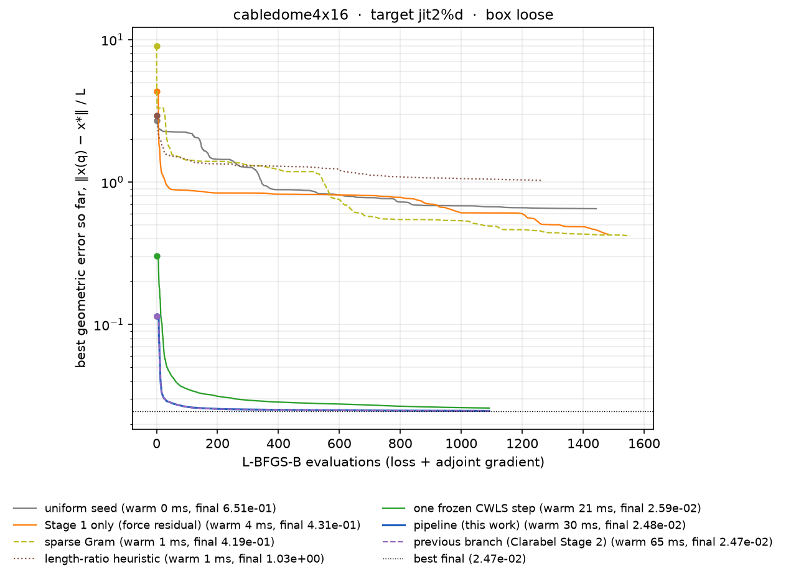
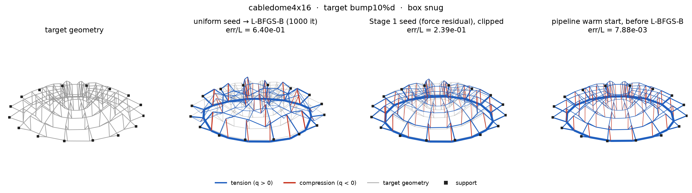
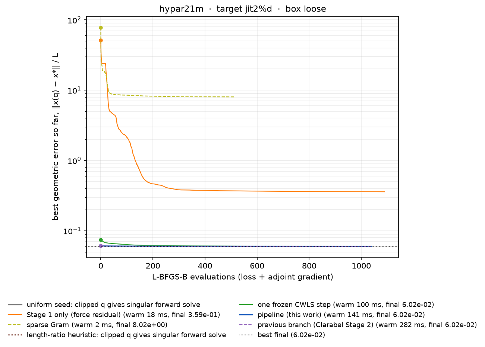
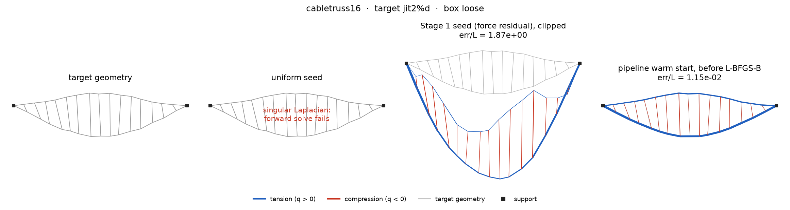

# Compliance-weighted warm starts for inverse FDM — 10-minute talk outline

Companion to [`warm_start.md`](warm_start.md) (the full write-up, with every
number's provenance). This file is the slide skeleton: one section per slide,
a time budget, the figure(s) to show, the two or three sentences to say, and
the numbers to have ready. All figures live in [`figures/`](figures/) and are
regenerated by the commands at the end.

Case-study numbers below are `‖x(q) − x*‖ / L` (geometric error over the
characteristic length), "start" = the clipped warm start handed to L-BFGS-B,
"final" = after 1000 L-BFGS-B iterations from that start.

---

## Slide 1 — Problem (0:00–1:00)

**Say.** We fit a force-density net to a designer's target geometry: find `q`
such that the FDM forward solve `x(q)` lands on `x*`, with `q` inside a box
(sign and magnitude limits per member). The workhorse is box-constrained
L-BFGS-B on `‖x(q) − x*‖²` with an adjoint gradient; the question is where to
start it. Uniform `q` is the default and it is either slow, or — on
mixed-sign, self-stressed nets — it stalls far from the target or cannot even
start.

**Show.** 

The benchmark family: 16 synthetic nets, tension, compression, mixed; quads
with mechanisms, creases, a hypar with struts, a cable dome, a tied arch, a
cable truss, a spoked wheel, a barrel vault. Edge colour is the sign of `q`,
width the member force.

**Numbers.** Suite of 64 cases (16 nets × {jittered, bumped target} ×
{loose, snug box}). Uniform seed: 4 cases fail outright (singular
Laplacian), 13 end more than 1.5× above the best reachable error after 1000
iterations, median 906 evaluations to get within 5 % of it.

---

## Slide 2 — The identity (1:00–2:30)

**Say.** At the target, the force residual in `q` is affine,
`r(q) = E(x*) q − p`. Because `E(x*) q = D(q) x* + D_f(q) x_f`, the forward
solve gives exactly

```
x(q) − x* = −D(q)⁻¹ r(q)
```

The geometric error is the force residual filtered through the compliance
`D(q)⁻¹`. Minimising `‖r‖` (Schek-style least squares, the Gram normal
equations) weights every node equally in force, so it over-weights stiff
nodes and barely sees the height error of shallow nets. Weighting by `D⁻¹`
gives the right linear model — compliance-weighted least squares, CWLS —
and `D(s·q) = s·D(q)` means the weighting depends only on the *pattern* of
`q`, so a signed uniform seed is a legitimate place to evaluate it.

**Show.** The equation, then one convergence plot as evidence that the
unweighted seeds start far away:



**Numbers (cable dome, jittered target, loose box).** Start/L: uniform 5.25,
Stage 1 (force residual) 4.35, sparse Gram 9.08, one CWLS step 0.30, full
pipeline 0.11. Final/L after 1000 iterations: uniform 0.65, Stage 1 0.43,
Gram 0.42 — L-BFGS-B never finds the self-stress balance from those seeds —
versus 0.025 from the CWLS seeds. The pipeline's *start* is already 4× below
where the force-residual seeds *end*.

---

## Slide 3 — Pipeline and sparsity (2:30–4:30)

**Say.** Four stages, all sparse LDLᵀ factorisations of a saddle system:
Stage 1 is the boxed force-residual particular (Clarabel, member-force form);
a seed guard races it against a scaled uniform seed when it looks collapsed;
one frozen CWLS step with the Jacobian at the target; two Gauss–Newton
steps re-linearising `D` at the current geometry with a Levenberg–Marquardt
safeguard. Bounds inside Stage 2 are handled by a primal-dual active set
with a monotone fallback, not an interior point. Nothing forms `EᵀE`.

**Show.** 

Then the dense trap: 

**Numbers.** Dense Gram: measured log–log slope 2.9–3.3 (cubic), 5.8 s and
125 MB at 4 k edges, extrapolates to ~180 GB and days at 150 k edges. Sparse
LDLᵀ of the same equations: 10 ms at 4 k, 0.26 s at 65 k; the two agree to
`1e-13`. Pipeline warm start against size: see Slide 7.

---

## Slide 4 — Case study: mixed-sign, self-stressed (4:30–5:45)

**Say.** The cable dome is where the weighting matters most. Every
unweighted seed starts 3–9 L off and after 1000 iterations is still 17–42×
above the reachable error: the optimiser cannot find the balance between
hoop tension and strut compression. One compliance-weighted step starts 12×
above that error, the full pipeline 4.6×, and L-BFGS-B converges from both;
with the snug box (backup) the pipeline's start *is* the optimum.

**Show.** 

Left to right: target; uniform seed after 1000 L-BFGS-B iterations
(err/L 0.65 — the hoops have sagged); the Stage 1 seed (force residual,
clipped: 4.35, geometry collapsed downward); the pipeline warm start before
any L-BFGS-B step (0.11).

**Backup.** Snug box, bumped target: pipeline start 7.9e-3 = final; uniform
seed ends at 0.64 (80× worse).


---

## Slide 5 — Case study: when uniform cannot even start (5:45–6:45)

**Say.** Hypar with edge struts, and the cable truss: with tension and
compression members of equal magnitude meeting at a node the Laplacian is
indefinite or singular, the forward solve fails, and L-BFGS-B never gets a
first gradient. The force-residual seeds do start but stall 6–130× off
(their geometry has folded through itself). The CWLS step lands within
20 % and the pipeline at the optimum.

**Show.** 


**Numbers (hypar, jittered, loose).** Uniform and length-ratio: singular
Laplacian. Stage 1: start 51.7, final 0.36. Sparse Gram: start 78, final
8.0 (stalled at 396 iterations). Frozen: 0.074 → 0.060. Pipeline:
0.0614 → 0.0602.

**Backup.** Cable truss: Stage 1 1.87 → 0.113, Gram 2.48 → 0.088, pipeline
0.0115 = final.


---

## Slide 6 — Case study: the seed guard, and reactions (6:45–8:00)

**Say (deep quad).** On the deep hanging quad (`depth = span`, jittered
target) Stage 1 collapses — its seed is 219 L off, 50× further than the
uniform seed. The previous branch, which trusted Stage 1, hands L-BFGS-B a
seed 59 L off and ends 48 % above the best; the guard notices, races both
seeds through Stage 2 and the pipeline ends at the best result.


**Say (tied arch).** A tie is a self-stress mode: the geometry does not
determine the tie force. With an exact target and no reaction rows the
inverse returns the centre of the box along that mode — tie force density
176, horizontal reaction 211 against a vertical reaction of 8.25. Adding the
zero-horizontal-reaction rows to the same least-squares system fixes the
tie at the funicular value (7.04) with `|Rx| = 5e-11`, at identical
geometric error. On a jittered target the reaction drops from 7.1 to 4.5e-7
for 0.6 % more geometric error.


---

## Slide 7 — Benchmarks (8:00–9:15)

**Show.** 

**Say.** Over the 64-case suite the pipeline is within 2 % of the best final
error on all 64 cases *before* L-BFGS-B takes a step; the previous Clarabel
branch on 59, one CWLS step on 54, the force-residual seeds on 32–37, uniform
on 26 with 4 failures. Median evaluations to reach 5 % of the best: 906
(uniform), 572–614 (force residual, Gram, length ratio), 84 (one CWLS
step), 0 (pipeline). Median warm-start cost 37 ms on 400–840-edge nets, a
third of the previous branch.

**Show.** 

Per showcase case: clipped start and final error relative to the best final.
Read the right panel: on the dome, hypar, truss, barrel and wheel at least
one unweighted seed ends 8–80× off; the pipeline is at 1.0 everywhere.

**Show.** 

Corner-anchored quads 1 k → 65 k edges (snug box, jittered target).
Per-factorisation cost grows near-linearly (7 ms → 1.1 s per sparse LDLᵀ
from 1 k to 65 k edges); the interior-point Stage 2 (`legacy`) costs the same
as the pipeline at 1–4 k edges and 2.7–3.9× at 16 k–65 k (526 s for three
steps at 65 k), and its start there is worse than uniform (18.6 vs 9.1)
because it trusts a collapsed Stage 1. The pipeline's start is 2.3× closer
than uniform at 16 k and 200 iterations from it end 25 % lower. The guard
racing both seeds accounts for about half the pipeline's cost at 4 k edges
and up.

**Backup.** 

---

## Slide 8 — Related work, limits, take-away (9:15–10:00)

**Say.** Schek's FDM and the Gram/least-squares inverse minimise the force
residual — the unweighted seeds here. Block & Lachauer's best-fit thrust
network is the same weighting in a different parameterisation. Pastrana's
JAX FDM handles mixed sign by seed sign and bounds and optimises the same
geometric loss with L-BFGS-B from a uniform seed; CEM parameterises trails
and deviations instead. Cuvilliers' thesis is the closest prior art on the
`D⁻¹` weighting. On the published JAX FDM and compas_cem cases the pipeline
hands over a start within 1–13 % of the reachable error on the exact
targets and never fails where the uniform seed hits a singular Laplacian
(4 of 8 CEM structures).

**Limits.** At 65 k edges the active set reaches its pass limit on the
second Gauss–Newton step; targets far outside the FDM image (heavily
jittered near-mechanisms) still need L-BFGS-B to do the work; reaction
constraints inconsistent with the box are only visible in the diagnostics.

**Take-away.** One identity, `x(q) − x* = −D(q)⁻¹ r(q)`, turns the classic
force-residual inverse into a geometric one; three sparse weighted
least-squares solves put L-BFGS-B at the answer on single-sign nets and make
mixed-sign, self-stressed nets solvable at all.

---

## Figure index

| file | content | source |
|---|---|---|
| `figures/gallery.png` | 16 suite nets at the funicular, sign/force colouring | `figures` export, `gallery.json` |
| `figures/pipeline.png` | pipeline block diagram | drawn in `render.py` |
| `figures/dense_vs_sparse.png` | dense vs sparse Gram time against `ne`, extrapolation to 150 k | `warm_start_bench dense` |
| `figures/scale.png` | warm-start time and start quality against `ne` (1 k–65 k) | `warm_start_bench scale` |
| `figures/suite_summary.png` | 64-case summary bars | table 4.2 of `warm_start.md` |
| `figures/start_vs_final.png` | showcase cases: start and final error relative to best | `figures` export |
| `figures/convergence_grid.png` | best-so-far error against evaluations, all showcase cases | `figures` export |
| `figures/case_<net>_<target>_<box>_geometry.png` | target / uniform-after-L-BFGS-B / Stage 1 seed / pipeline warm start | `figures` export |
| `figures/case_<net>_<target>_<box>_convergence.png` | one case, all methods, legend with warm-start ms and final | `figures` export |
| `figures/reactions_tiedarch.png` | straight-tie arch with and without `enforce_zero_rx`, reaction arrows | `figures` export, `reactions_tiedarch16s.json` |

Showcase cases exported: `cabledome4x16` (jit loose, bump snug),
`hypar21m`, `cabletruss16`, `quad21c_d1`, `holes21c`, `crease21`,
`barrel16x12`, `wheel24a4`, `tiedarch16` (all jit loose), `oculus21h7`
(bump loose).

## Regenerating

```bash
cargo build --release -p theseus --example warm_start_bench
B=target/release/examples/warm_start_bench
$B figures bench/figures/data                 # ~20 s, showcase cases + gallery + reactions
$B dense  > bench/figures/data/dense.txt      # ~10 s
BENCH_METHODS=uniform,s1,gram_sparse,gram_dense,length_ratio,frozen,pipeline,legacy \
$B scale  > bench/figures/data/scale.txt      # ~15 min (65 k edges, legacy Stage 2 dominates)
cd bench/figures && uv run render.py          # writes docs/figures/*.png
```

`BENCH_ITERS` caps L-BFGS-B (default 1000), `BENCH_NETS=a,b` restricts the
showcase cases. The JSON under `bench/figures/data/` is not tracked (5–6 MB);
`dense.txt` and `scale.txt` are.
