# Compliance-weighted warm starts for inverse force-density form finding

Presentation outline and technical write-up for the Stage-1/Stage-2 warm start
implemented in `crates/theseus/src/inverse.rs` and `inverse_extra.rs`. All
numbers below were produced by `cargo run --release -p theseus --example
warm_start_bench -- <subcommand>` on the branch that introduced this document;
the tables are reproducible with the commands quoted in each section.

Figures referenced below are in [`figures/`](figures/) and are regenerated by
`warm_start_bench figures` + `bench/figures/render.py`; the slide-by-slide
skeleton that uses them is [`presentation_outline.md`](presentation_outline.md).

---

## 1. Problem statement

Given a network topology, fixed node positions `x_f`, free-node loads `p`, and a
**target** geometry `x*` for the free nodes, find force densities `q` such that
the force-density forward solve lands on the target:

```
D(q) x(q) = p − D_f(q) x_f,      D(q) = Cₙᵀ diag(q) Cₙ,   D_f(q) = Cₙᵀ diag(q) C_f
x(q) ≈ x*   with   lo ≤ q ≤ hi
```

Downstream, a nonlinear optimiser (L-BFGS-B on the forward solve with the hard
box `[lo, hi]`) refines `q` against the full objective. The question addressed
here is **what to hand that optimiser as its starting point**, and at what cost.

Constraints that shaped the design:

* Networks up to ~150 k edges: everything must be sparse, `O(nnz)` memory, and
  should scale roughly like one sparse factorisation per step.
* Tension-only, compression-only, and **mixed-sign** systems (tied arches,
  cable trusses, cable domes, barrel vaults with ties).
* Reaction constraints (e.g. "no horizontal reaction at the supports of a tied
  arch") must be honoured and must be detected when they are inconsistent.

---

## 2. The identity everything rests on

At the target geometry the FDM residual in force-density coordinates is

```
r(q) = E(x*) q − p,      E(x*) = Cₙᵀ diag(Cₙ x* + C_f x_f)   (stacked per axis)
```

and because `E(x*) q = D(q) x* + D_f(q) x_f`, the forward solve satisfies

```
x(q) − x* = − D(q)⁻¹ r(q).
```

So the **geometric error is the force residual pre-conditioned by the
compliance `D(q)⁻¹`**. Two consequences:

1. Minimising `‖r(q)‖` (the classic "force residual" inverse, Schek-style
   least squares on the equilibrium matrix) is *not* minimising the geometric
   error. It weights every node equally in force, which weights stiff nodes too
   much and soft nodes too little. On shallow nets the vertical rows of `E` are
   small (`Δz ≪ Δx`), so the force residual barely sees the height error at all.
2. The correct linear model of the geometric error around `q_k` is

   ```
   x(q_k + Δ) − x* ≈ − D(q_k)⁻¹ ( r(q_k) + E(x(q_k)) Δ )
   ```

   which is a **compliance-weighted least squares (CWLS)** problem in `Δ`. With
   the Jacobian taken at the target, `E(x*)`, it is a *frozen* CWLS step; with
   the Jacobian re-assembled at the current geometry `x(q_k) = x* − D⁻¹r`, it is
   an exact Gauss--Newton step. Both share the same fixed point since
   `E(x(q)) = E(x*)` once the target is hit.

A useful invariance: `D(s·q) = s·D(q)`, so the CWLS weighting depends only on
the *pattern* of `q_k`, not on its scale. This is why a uniform seed with the
right sign pattern is a legitimate metric seed.

---

## 3. Pipeline

```
target x*, loads p, box [lo,hi]
        │
        ▼
 (0) non-dimensionalise ── positions / L, loads / P, q · L/P
        │
        ▼
 (1) Stage 1: force-residual particular  min ‖E(x*)q − p‖²  s.t. box
        │        (Clarabel QP in member-force coordinates; sparse)
        ▼
 (2) seed guard ── score Stage-1 seed vs scaled uniform sign seed on ‖x(q)−x*‖
        │           suspicious?  → race both through steps (3)–(4), keep the better
        ▼
 (3) frozen CWLS step(s)   min ‖S(q_k)⁻¹(E(x*)Δ + r_k)‖² + λ_c‖Δ‖²  s.t. box
        │                  (active-set BVLS on the sparse weighted saddle)
        ▼
 (4) Gauss--Newton step(s)   same, Jacobian at x(q_k); step halved until the
        │                    exact merit ‖x(q)−x*‖² + w²‖R(q)‖² decreases
        ▼
 warm-start q  →  L-BFGS-B (DirectBoxBounds)
```

Default budget: one frozen step, two Gauss--Newton steps (`max_frozen_outer =
1`, `max_outer = 2`), i.e. three sparse least-squares solves plus the probes.
Do not drop the frozen step; it is the metric change. Do not generally drop
the Gauss--Newton steps either — they are already skipped when the frozen
step has solved a reachable target, and on Pastrana's creased-shell designer
surface they are what leaves the frozen CWLS basin (see
[`gn_vs_lbfgs.md`](gn_vs_lbfgs.md) §7). The honest place to spend L-BFGS-B
instead of more linearisations is *after* that short Stage-2 budget.

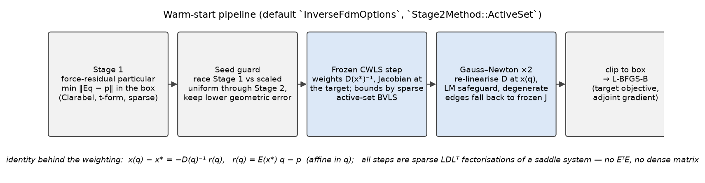

### 3.1 Non-dimensionalisation (`nondimensionalize`)

Positions are divided by the bounding-box diagonal `L`, loads by `P = max|p|`;
force densities transform as `q̃ = q·L/P`, the box likewise, and the Tikhonov
terms as `λ̃ = λ/L²` (Stage 1) and `λ̃_c = λ_c P²/L⁴` (Stage 2) so that every
objective is the original divided by a constant. The recovered `q` is identical
in exact arithmetic; what changes is the conditioning of the KKT systems handed
to LDL and Clarabel, which previously failed in millimetre units. It also makes
the relative weight of reaction rows against geometric rows unit-free.

### 3.2 Stage 1

Unchanged in spirit: the box-constrained least-squares particular of the
equilibrium matrix at the target, in member-force coordinates (`solve_for_q =
false`) so that the box is expressed on `t = q·ℓ` with the target lengths. It is
the only place in the pipeline where the self-stress pattern of a self-tied
system can be recovered, and it is cheap (one interior-point solve on a sparse
system with `3n_free (+ reaction rows) × n_edges` entries).

### 3.3 Seed guard (`seed_guard_margin`, default 3)

Stage 1 collapses on shallow targets with white-noise perturbations: it trades
height error against in-plane force balance, and returns a seed whose forward
geometry can be an order of magnitude further from the target than a uniform
`q` would be. The guard builds a uniform seed with the sign pattern of the box
(or of Stage 1 where the box allows both signs), fits its magnitude per sign
group by a golden-section search on the exact geometric error (20 Laplacian
factorisations per group), and compares. If Stage 1 is worse by more than the
margin it is *suspect*; both seeds then run the *whole* of Stage 2 (frozen
step and Gauss--Newton steps) and the lower final geometric error continues.
A branch from which no damped step was accepted at all loses to one that
moved, whatever its error: an unmoved seed has taught Stage 2 nothing about
the target. The race costs a second Stage 2 only when the guard fires
(≈ 2× warm-start time on those cases, e.g. 233 ms instead of 121 ms on the
840-edge jittered quad). Measured effect (Section 4.4): on the loose-box
jittered quads the guard is what separates the pipeline from the previous
branch; where Stage 1 is fine the race picks Stage 1 and nothing changes.

Two earlier shortcuts were removed after the external case studies
(Section 6.1): deciding on the *raw* seed error alone beyond the square of the
margin, and deciding after the frozen step only. On the CEM curved bridges the
Stage-1 seed lands 40× further from a jittered target than the uniform seed
does, yet the compliance-weighted steps recover it to a warm start that
L-BFGS-B takes to 0.08 L, while the "better-looking" uniform seed sits at a
point where no damped step is accepted and L-BFGS-B stalls at 0.34–0.58 L.

### 3.4 Frozen CWLS step

Solves the weighted least squares as a sparse saddle system

```
[ I      0      Sᵀ ] [ e ]   [ 0  ]
[ 0      Λ    −Eᵀ  ] [ Δ ] = [ 0  ]        S = [ D 0 0 0 ; 0 D 0 0 ; 0 0 D 0 ; wG_x wG_y wG_z I ]
[ S     −E      0  ] [ y ]   [ r  ]
```

with a single sparse LDL factorisation (faer). Nothing dense is ever formed; the
saddle has `2m + n` rows with `m = 3n_free + n_reaction_rows` and `nnz ≈
3·nnz(D) + 2·nnz(E) + m + n + nnz(G)·n_reaction_axes`. The variable `e` is the
weighted residual: on the free-node rows it is `x* − x(q_k + Δ)` to first
order, on the reaction rows the weighted support reaction (Section 3.7).

### 3.5 Bounds inside Stage 2: active-set BVLS (`Stage2Method::ActiveSet`)

The box on `Δ` is handled by a primal–dual add/release active set
(Hintermüller–Ito–Kunisch style, both sides updated in one sweep):

1. Solve the saddle with the currently bound columns held at their bound
   (their coupling entries are kept in the pattern but zeroed and their
   contribution moved to the right-hand side, so the **symbolic factorisation is
   reused** across passes and across outer steps).
2. Free variables that left the box are fixed at the violated bound; bound
   variables whose reduced gradient `∇f_j = Λ_j Δ_j − E_jᵀ y` points into the box
   are released. Releases stop after 12 passes so the sweep is monotone.
3. The pass ends only when the set is unchanged. (An earlier shortcut that
   clamped one or two still-toggling variables was measured to leave the step up
   to 7× above the QP optimum on the cable dome; with the sweep run to a quiet
   set the active-set objective is at or below Clarabel's on every subproblem
   checked.)
4. **Monotone safeguard.** Independently of the set, a feasible iterate
   (starting from `Δ = 0`) is advanced along the projected path towards each
   trial by a line search on the QP objective `½‖S⁻¹(JΔ + r)‖² + ½ΣΛ_jΔ_j²`
   (one sparse matvec and one cached compliance solve per probe). That
   iterate is what the step returns: on a settled sweep it *is* the KKT point
   (the feasible trial is the first candidate), on a sweep that cycles or
   hits the 24-pass limit it is a feasible descent step no worse than any
   trial seen. This replaced an interior-point fallback that cost 180 s per
   step at 65 k edges (Section 5.2).
5. The bound status persists to the next outer step as a warm start.

Typical cost: 2–5 numeric refactorisations per step on the loose boxes, 5–13 on
snug boxes where many edges sit on a bound, against a 15–30-iteration
interior-point solve whose per-iteration cost is a factorisation of a larger
KKT system. The result is exact (no barrier smoothing of the bound) whenever
the sweep settles, which it does on every suite case. Clarabel remains
selectable (`Stage2Method::Clarabel`) and is the fallback only after a
numerical failure of the sparse solve.

### 3.6 Gauss--Newton step and step control (`lm_damping`, default 0)

With the Jacobian re-assembled at `x(q_k)` (no forward solve: `x(q_k) = x* −
S⁻¹r_k` is already known from the probe), each candidate `q_k + αΔ` is scored by
the exact probe `‖S(q)⁻¹ r(q)‖`, and `α` is halved until the merit decreases.
A Levenberg--Marquardt alternative is implemented (`Λ_j = λ_c + λ_LM s_j` with
`s_j ≈ diag(Jᵀ S⁻² J)_j` by an 8-probe Hutchinson estimate, `λ_LM` growing
×10, ×100, ×1000 on rejections) but is **off by default**: Marquardt scaling
penalises exactly the long, nearly flat moves along the self-stress directions
of mixed-sign nets, and the sweep in Section 4.4 shows `λ_LM = 1e-4` losing on
cable domes and near-exact tied arches while `λ_LM = 0` is within 2 % of the
best warm start on every suite case. The overshoot the damping was introduced
for is removed by the seed guard instead.

If the current iterate's geometry has folded an edge onto zero length (two
nodes coincident, so the edge direction is undefined), the Jacobian cannot be
assembled there; the step then uses the frozen (target) Jacobian and the
event is counted in `InverseDiagnostics::degenerate_linearizations` rather
than aborting the solve. This came out of the CEM curved bridge with 22
hangers (Section 6.1), whose short deck members fold under a jittered target.

### 3.7 Reaction constraints (`enforce_zero_r{x,y,z}`, `reaction_weight`)

`enforce_zero_rx` appends one row per fixed node requiring its x-reaction to
vanish. For a pin–pin tied arch this is what forces the thrust into the tie
instead of into the supports: without it the tie force is a *self-stress mode
invisible to the geometry*, and Stage 1 returns the analytic centre of the box
along that mode (Section 4.5 shows `Rx = 211` against a vertical reaction of
`8.25`).

Two details make the rows behave:

* **Consistency check.** The rows pin *every* support, so they are consistent
  only if the applied load has no net component along that axis. The solver
  rejects `enforce_zero_rz` under vertical load with an explicit error instead
  of silently returning a collapsed particular. A request that is inconsistent
  with the *box* (e.g. zero horizontal reaction on a cable truss whose two
  chords are both tension-only) cannot be detected a priori; it shows up as a
  large `reaction_residual` in the diagnostics.
* **Realised reactions, not target-geometry reactions.** The reaction of a
  forward solve at `q` is `R(q) = E_R(x(q)) q`, and `E_R(x(q)) q = E_R(x*) q −
  G (x* − x(q))` with `G = C_fᵀ diag(q) C_n`. Linearising `R(q_k + Δ)` gives the
  residual at the target, the Jacobian at the current geometry, **and** a
  coupling term `−w G e_geo` to the free-node error. The first two were already
  in place; the coupling is the `wG` block of `S` above. Without it the
  pipeline minimised the reaction *at the target geometry*, which on a jittered
  target can be tiny while the realised reaction is larger than without the
  constraint (`tiedarch16`: proxy `1.3e-3`, realised `5.9` vs `4.1`
  unconstrained). With it the realised horizontal reactions on the tied arches
  fall to `1e-5`–`1e-7` of the vertical (Section 4.5), and the merit the
  Stage-2 steps are accepted on is what a forward solve at the returned `q`
  reports.

`reaction_weight` scales the rows (default 1: one load unit of reaction counts
like one target extent of geometric error, in dimensionless form). Weight 10
pushes the Stage-1 particular harder but makes the Stage-2 system worse
conditioned; on the suite it gave *larger* realised reactions after the same
three steps, so 1 is recommended.

---

## 4. Benchmarks

### 4.1 Protocol (`warm_start_bench suite 1000`)

Every case is a synthetic net with a *known* funicular `x₀ = x(q_true)`,
perturbed into a target, so that the quality of a warm start can be measured
both before and after the downstream optimiser:

* **Nets** (18, `warm_start_bench nets`): corner-anchored quads at depth/span
  0.25 and 1.0 (`quad21c`, `quad21c_d1`), the same in compression
  (`quad21c_comp`), quads with holes (`holes21c`), diamond and radial nets,
  an oculus with an inner ring, two creased vaults (`crease21`, `creasediag21`:
  a folded ridge with 80 supports), a hypar with mixed-sign struts (`hypar21m`),
  a spoked wheel with a compression rim (`wheel24a4`), a tied arch with curved
  hangers (`tiedarch16`) and one with a straight tie (`tiedarch16s`), a cable
  truss (`cabletruss16`), a 4-ring cable dome (`cabledome4x16`), and a barrel
  vault with tension ties (`barrel16x12`). Of the 18, eight are single-sign tension, three
  single-sign compression, seven mixed-sign; the mixed-sign nets are self-tied
  and carry self-stress modes. The suite runs 16 of them (the compression
  radial and oculus are mirrors of their tension versions).
* **Targets**: `jit2%d` adds white noise of 2 % of the depth to every free
  node; `bump10%d` adds a smooth `sin·sin` push of 10 % of the depth. The
  jittered targets are not in the FDM image, so `min ‖x(q) − x*‖` has a
  nonzero optimum; the bumped ones are close to it.
* **Boxes**: `loose` is `[min|q_true|/100, 100·max|q_true|]` per sign group,
  `snug` is `[min|q_true|, max|q_true|]` (the optimum sits on bounds).
* **Methods**: `uniform` (magnitude 1, true signs); `s1` (Stage 1 only);
  `gram_sparse` and `gram_dense` (Tikhonov-shifted normal equations
  `(EᵀE + λI)q = Eᵀp`, unboxed then clipped, sparse LDL vs dense Cholesky);
  `length_ratio` (the practitioner update `q ← q·ℓ(q)/ℓ*`, one forward solve
  per sweep, best of 20); `frozen` (Stage 1 + guard + one frozen CWLS step);
  `pipeline` (the default: Stage 1 + guard + 1 frozen + 2 Gauss--Newton,
  active set, dimensionless); `legacy` (the previous branch: Stage 1 + the
  same three steps with Clarabel, no guard, dimensional); `pipeline_noguard`.
* **Downstream**: every warm start is clipped into the L-BFGS-B box and
  L-BFGS-B (`DirectBoxBounds`) runs for up to 1000 iterations on the SSE
  target objective. `best` is the smallest final error over all methods for
  that case; `ev<1.05b` is the number of loss evaluations until the trace is
  within 5 % of `best`.

64 cases = 16 suite nets × 2 targets × 2 boxes. Times are single-threaded
wall clock on the benchmark machine (4 vCPU).

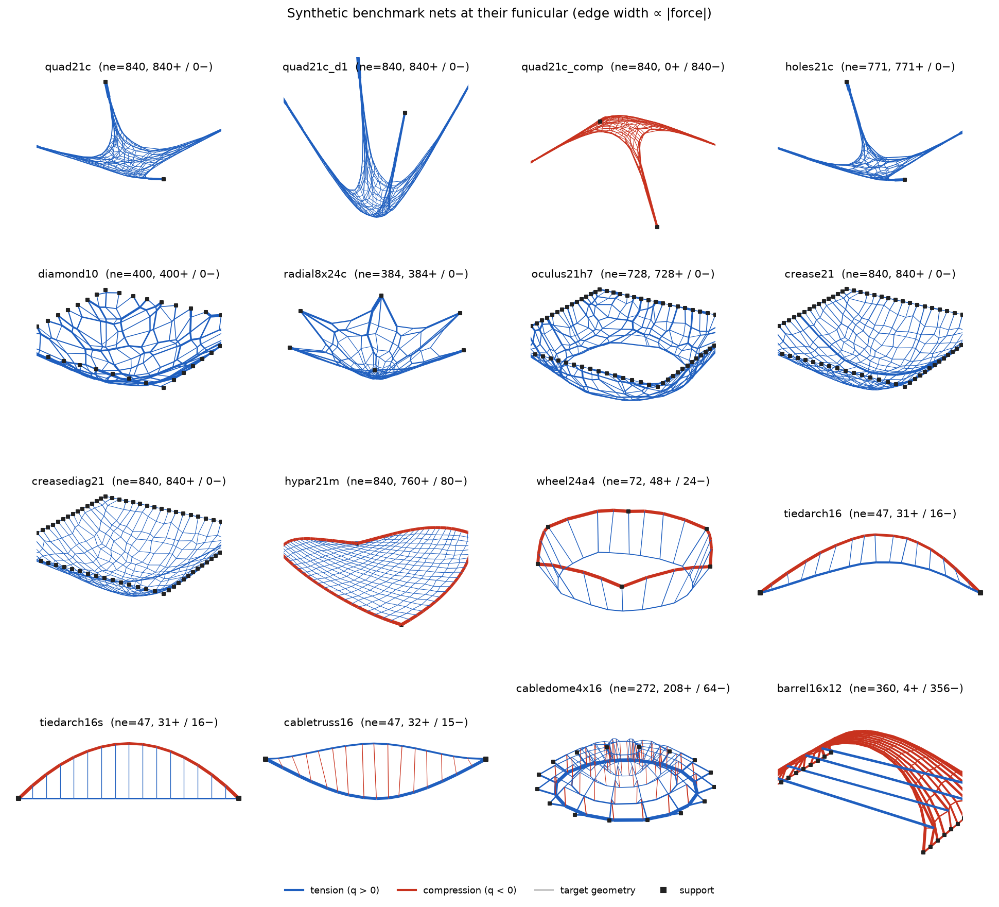

*Figure: the suite nets at `x(q_true)`; blue = tension, red = compression,
edge width ∝ member force, squares = supports.*

### 4.2 Summary over the 64 cases

| method | failures | median final/best | cases ≤ 1.02·best | cases ≤ 1.05·best | cases > 1.5·best | median ev<1.05b | never within 5 % | median clipped start / best | median warm-start ms | max ms |
|---|---|---|---|---|---|---|---|---|---|---|
| uniform | 4 | 1.029 | 26 | 35 | 13 | 906 | 25 | 51.6 | 0.0 | 0.0 |
| s1 (Stage 1 only) | 0 | 1.014 | 37 | 45 | 13 | 572 | 22 | 27.6 | 7.6 | 19.1 |
| gram_sparse | 0 | 1.019 | 32 | 42 | 17 | 577 | 22 | 55.7 | 1.1 | 2.1 |
| gram_dense | 0 | 1.020 | 34 | 42 | 17 | 584 | 22 | 55.7 | 17.4 | 57.4 |
| length_ratio | 4 | 1.016 | 31 | 42 | 12 | 614 | 18 | 5.2 | 5.2 | 12.9 |
| frozen (1 CWLS step) | 0 | 1.000 | 54 | 61 | 0 | 84 | 7 | 1.15 | 25.6 | 100.9 |
| **pipeline** | 0 | 1.000 | **64** | **64** | 0 | **0** | 4* | **1.00** | 37.0 | 200.7 |
| legacy (Clarabel Stage 2) | 0 | 1.000 | 59 | 60 | 3 | 0 | 7 | 1.00 | 110.7 | 394.8 |
| pipeline_noguard | 0 | 1.000 | 62 | 63 | 0 | 0 | 5 | 1.00 | 31.4 | 284.8 |

`*` the four pipeline entries are bumped tied-arch and cable-truss cases whose
targets lie in the FDM image, so all errors are at round-off (`1e-10·L`) and
"within 5 %" is meaningless.
"failures" are singular Laplacians or NaN after clipping (e.g. the uniform
seed on the hypar and the cable truss, where a single-magnitude `q` of both
signs makes `D` indefinite). The sparse Gram originally failed on the four
nets with edges joining two fixed nodes: such an edge has an all-zero column
in `E`, hence a structurally empty diagonal in `EᵀE`, and `add_diagonal` did
not create the entry, so the LDL met an exact zero pivot. Fixed on this
branch; sparse and dense Gram now agree on every case.

Reading: the force-residual seeds (`s1`, both Grams) start 30–130× above the
reachable error and L-BFGS-B needs 600–900 evaluations to get within 5 % of it,
when it gets there at all. One compliance-weighted step (`frozen`) brings the
median start to 1.15× the optimum; the full pipeline lands **within 2 % of the
best final error on all 64 cases before L-BFGS-B takes a single step**, at a
third of the cost of the Clarabel-based previous branch.

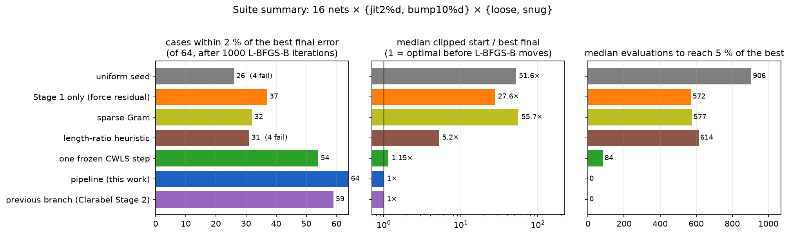

### 4.3 Selected cases

Entries are `clipped start / best`, `final / best` after 1000 L-BFGS-B
iterations, and `ev<1.05b` (`–` = not reached within 1000 evaluations).

| case (best final err/L) | uniform | s1 | gram_sparse | length_ratio | frozen | pipeline | legacy |
|---|---|---|---|---|---|---|---|
| quad21c jit2%d loose (5.44e-02) | 34.9 / 1.049 / 1090 | 2.14e+03 / 1.065 / – | 1.97e+03 / 1.063 / – | 5.15 / 1.027 / 616 | 3.01 / 1.033 / 783 | 1.97 / 1.000 / 115 | 3.3 / 1.013 / 436 |
| quad21c_d1 jit2%d loose (1.55e-01) | 29.1 / 1.053 / – | 1.41e+03 / 1.048 / 1066 | 953 / 1.056 / – | 3.61 / 1.003 / 608 | 6.32 / 1.034 / 905 | 4.27 / 1.000 / 562 | 381 / 1.475 / – |
| quad21c_comp jit2%d loose (5.44e-02) | 34.9 / 1.050 / 1095 | 2.14e+03 / 1.061 / – | 1.97e+03 / 1.065 / – | 5.15 / 1.028 / 612 | 3.01 / 1.038 / 862 | 1.97 / 1.000 / 116 | 3.3 / 1.013 / 416 |
| holes21c jit2%d loose (5.60e-02) | 21.7 / 1.107 / – | 2.64e+03 / 1.320 / – | 2.31e+03 / 2.491 / – | 2 / 1.026 / 654 | 3.55 / 1.068 / – | 2.76 / 1.000 / 316 | 12.9 / 1.027 / 838 |
| crease21 jit2%d loose (4.06e-02) | 16.4 / 1.001 / 386 | 134 / 19.505 / – | 127 / 1.001 / 518 | 3.06 / 1.001 / 317 | 2.16 / 1.000 / 253 | 1.02 / 1.000 / 0 | 1.06 / 1.000 / 6 |
| creasediag21 bump10%d loose (8.13e-03) | 73.5 / 1.023 / 915 | 7.21 / 1.018 / 796 | 7.2 / 1.018 / 790 | 7.87 / 1.010 / 748 | 1.05 / 1.000 / 0 | 1 / 1.000 / 0 | 1 / 1.000 / 0 |
| hypar21m jit2%d loose (6.02e-02) | fail | 859 / 5.963 / – | 1.3e+03 / 133.311 / – | fail | 1.23 / 1.000 / 111 | 1.02 / 1.000 / 0 | 1.02 / 1.000 / 0 |
| barrel16x12 jit2%d loose (3.05e-02) | 461 / 8.791 / – | 60.5 / 1.003 / 187 | 60.5 / 1.003 / 183 | 94.1 / 13.208 / – | 1.09 / 1.001 / 29 | 1 / 1.000 / 0 | 1 / 1.000 / 0 |
| cabledome4x16 jit2%d loose (2.47e-02) | 212 / 24.133 / – | 176 / 17.440 / – | 367 / 16.947 / – | 119 / 39.211 / – | 12.3 / 1.047 / 1044 | 4.63 / 1.000 / 138 | 4.63 / 1.000 / 129 |
| cabledome4x16 bump10%d snug (7.87e-03) | 365 / 80.435 / – | 30.4 / 2.194 / – | 2.07e+03 / 100.114 / – | 365 / 80.435 / – | 5.45 / 1.084 / – | 1 / 1.000 / 0 | 1 / 1.000 / 0 |
| tiedarch16 jit2%d loose (8.92e-03) | 2.21e+04 / 1.000 / 196 | 59.6 / 1.000 / 291 | 366 / 1.000 / 220 | 64.4 / 2.386 / – | 2.1 / 1.000 / 150 | 1 / 1.000 / 0 | 1 / 1.000 / 0 |
| cabletruss16 jit2%d loose (1.15e-02) | fail | 162 / 9.818 / – | 216 / 7.639 / – | fail | 2.36 / 1.000 / 471 | 1.02 / 1.000 / 0 | 1 / 1.000 / 0 |
| wheel24a4 jit2%d loose (1.26e-02) | 347 / 8.857 / – | 7.21 / 1.000 / 167 | 7.21 / 1.000 / 162 | 11.1 / 1.000 / 193 | 1.01 / 1.000 / 0 | 1 / 1.000 / 0 | 1 / 1.000 / 0 |
| oculus21h7 bump10%d loose (4.85e-03) | 154 / 1.085 / – | 3.86 / 1.009 / 477 | 3.86 / 1.012 / 469 | 7 / 1.058 / – | 1.01 / 1.000 / 0 | 1 / 1.000 / 0 | 1 / 1.000 / 0 |
| diamond10 jit2%d snug (2.84e-02) | 24.4 / 1.000 / 268 | 44.5 / 1.000 / 202 | 50.9 / 1.000 / 267 | 1.97 / 1.000 / 167 | 1.06 / 1.000 / 15 | 1 / 1.000 / 0 | 1 / 1.000 / 0 |

Observations worth putting on a slide:

* **Mixed-sign, self-stressed nets are where the weighting matters most.** On
  the cable dome every unweighted seed starts 100–370× off (jittered target,
  loose box) and L-BFGS-B ends 17–39× above the optimum after 1000
  iterations: it never finds the self-stress balance. The frozen step gets
  within 5 %, the pipeline to the optimum. On the cable truss, the wheel and
  the barrel at least one unweighted seed ends 8–13× off; only the 47-edge
  tied arch is recovered by L-BFGS-B from any seed.
* **Deep quads separate the pipeline from the previous branch.** On
  `quad21c_d1` (depth = span) with the jittered target the Clarabel Stage 1
  collapses (seed 381× off) and `legacy` never recovers (1.48× the best after
  1000 iterations); the seed guard replaces it by the uniform seed and the
  pipeline reaches the best result. Same on `holes21c`.
* **Compression mirrors tension exactly** (`quad21c_comp` = `quad21c` to
  three digits), as the invariance `D(−q) = −D(q)` predicts.
* **Creases and the hypar with struts** are solved by the first frozen step
  on the bumped targets; on jittered targets the Gauss--Newton steps still
  matter (`crease21`: 2.16× → 1.02×).
* `length_ratio` is a good cheap seed for shallow single-sign nets (3–5× off
  at 5 ms) and useless on anything with a compression member.

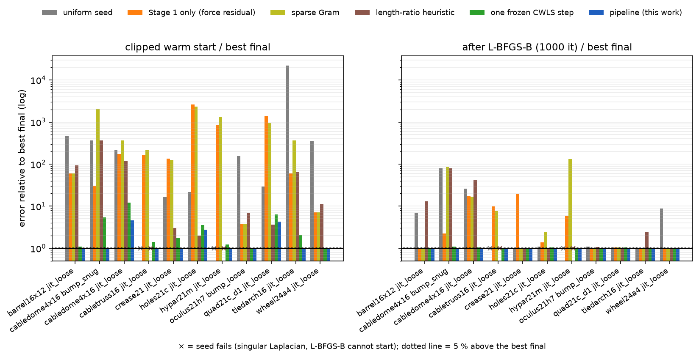

*Figure: eleven showcase cases (`warm_start_bench figures`). Left: clipped
warm start over the best final error; right: final error after 1000
L-BFGS-B iterations over the best. `×` marks a seed whose forward solve
fails.*

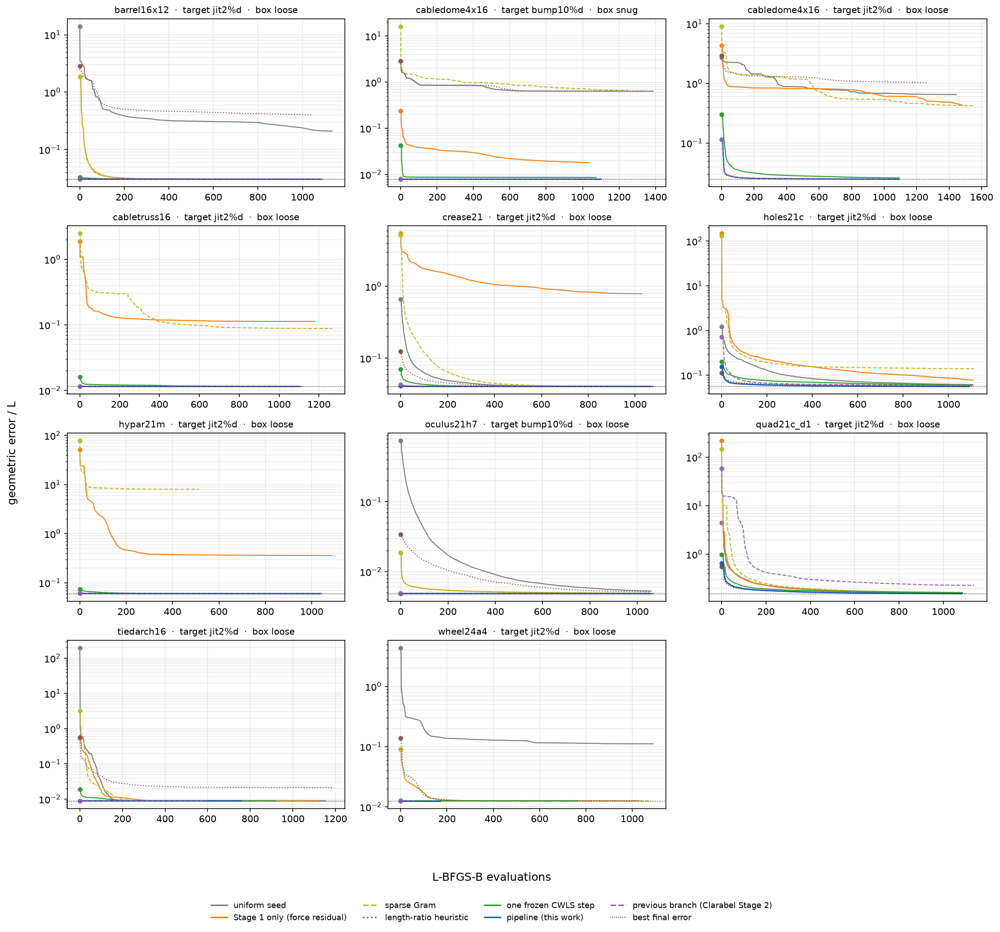

Geometry of the handed-over start for the three cases discussed above:

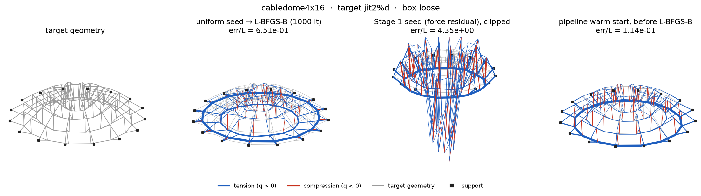
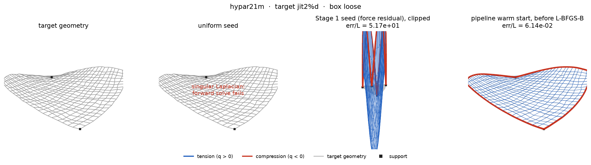
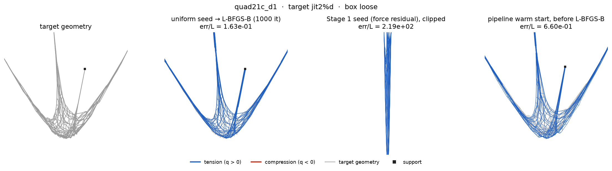

*Figure: target; uniform seed after 1000 L-BFGS-B iterations; Stage 1 seed
(clipped); pipeline warm start before L-BFGS-B. Per-case
`case_<net>_<target>_<box>_{geometry,convergence}.png` exist for all eleven
showcase cases.*

### 4.4 Ablations (`BENCH_*` overrides, five nets, 20 cases)

Entries are `clipped start / best`, `final / best`, `ev<1.05b`, warm-start
ms, all relative to the best final error over the six configurations; the
exact-target tied-arch rows (round-off level) are omitted.

| case | pipeline (default) | Stage 2 = Clarabel | guard off | dimensional | λ_LM = 1e-4 | legacy |
|---|---|---|---|---|---|---|
| quad21c_d1 jit2%d loose | 4.27 / 1.000 / 496 / 141 | 1.99 / 1.021 / 518 / 1802 | 665 / 1.470 / 744 / 298 | 4.27 / 1.000 / 513 / 139 | 2.93 / 1.001 / 501 / 166 | 381 / 1.478 / – / 391 |
| quad21c_d1 jit2%d snug | 1.92 / 1.004 / 278 / 131 | 1.8 / 1.004 / 357 / 3600 | 1.82 / 1.000 / 247 / 134 | 1.92 / 1.002 / 287 / 130 | 1.54 / 1.002 / 269 / 164 | 1.82 / 1.000 / 258 / 236 |
| quad21c_d1 bump10%d loose | 2.21 / 1.008 / 155 / 128 | 1.08 / 1.037 / 426 / 561 | 2.21 / 1.006 / 154 / 115 | 2.21 / 1.007 / 148 / 127 | 1.03 / 1.000 / 0 / 85 | 2.21 / 1.007 / 184 / 335 |
| quad21c_d1 bump10%d snug | 1.02 / 1.001 / 0 / 198 | 1.03 / 1.010 / 0 / 1317 | 1.02 / 1.001 / 0 / 190 | 1.02 / 1.001 / 0 / 201 | 1 / 1.000 / 0 / 97 | 1.01 / 1.001 / 0 / 249 |
| crease21 jit2%d loose | 1.02 / 1.000 / 0 / 79 | 1.48 / 1.001 / 406 / 570 | 1.06 / 1.000 / 6 / 70 | 1.02 / 1.000 / 0 / 80 | 1.02 / 1.000 / 0 / 80 | 1.06 / 1.000 / 6 / 257 |
| crease21 jit2%d snug | 1 / 1.000 / 0 / 111 | 1.02 / 1.000 / 0 / 1277 | 1 / 1.000 / 0 / 78 | 1 / 1.000 / 0 / 112 | 1 / 1.000 / 0 / 110 | 1 / 1.000 / 0 / 199 |
| crease21 bump10%d loose | 1 / 1.000 / 0 / 48 | 1.22 / 1.001 / 116 / 394 | 1 / 1.000 / 0 / 39 | 1 / 1.000 / 0 / 48 | 1 / 1.000 / 0 / 49 | 1 / 1.000 / 0 / 254 |
| crease21 bump10%d snug | 1 / 1.000 / 0 / 54 | 1.05 / 1.000 / 0 / 452 | 1 / 1.000 / 0 / 44 | 1 / 1.000 / 0 / 54 | 1 / 1.000 / 0 / 54 | 1 / 1.000 / 0 / 195 |
| hypar21m jit2%d loose | 1.02 / 1.000 / 0 / 142 | 1.18 / 1.000 / 53 / 410 | 1.02 / 1.000 / 0 / 99 | 1.02 / 1.000 / 0 / 140 | 1.01 / 1.000 / 0 / 137 | 1.02 / 1.000 / 0 / 281 |
| hypar21m jit2%d snug | 1 / 1.000 / 0 / 151 | 1.16 / 1.000 / 74 / 1353 | 1 / 1.000 / 0 / 106 | 1 / 1.000 / 0 / 150 | 1 / 1.000 / 0 / 140 | 1 / 1.000 / 0 / 214 |
| hypar21m bump10%d loose | 1.13 / 1.000 / 8 / 142 | 6.36 / 1.004 / 722 / 382 | 1.17 / 1.000 / 8 / 107 | 1.13 / 1.000 / 8 / 140 | 1.11 / 1.000 / 7 / 141 | 1.17 / 1.000 / 8 / 298 |
| hypar21m bump10%d snug | 1 / 1.000 / 0 / 131 | 1.05 / 1.000 / 2 / 1944 | 1 / 1.000 / 0 / 88 | 1 / 1.000 / 0 / 130 | 1 / 1.000 / 0 / 132 | 1 / 1.000 / 0 / 210 |
| tiedarch16 jit2%d loose | 1 / 1.000 / 0 / 3 | 1 / 1.000 / 0 / 7 | 1 / 1.000 / 0 / 2 | 1 / 1.000 / 0 / 3 | 1.01 / 1.000 / 0 / 3 | 1 / 1.000 / 0 / 4 |
| tiedarch16 jit2%d snug | 1 / 1.000 / 0 / 3 | 1 / 1.000 / 0 / 5 | 1 / 1.000 / 0 / 2 | 1 / 1.000 / 0 / 3 | 1 / 1.000 / 0 / 3 | 1 / 1.000 / 0 / 3 |
| cabledome4x16 jit2%d loose | 4.63 / 1.001 / 138 / 26 | 4.4 / 1.002 / 143 / 125 | 4.63 / 1.001 / 138 / 15 | 4.63 / 1.000 / 131 / 27 | 4.31 / 1.722 / – / 29 | 4.63 / 1.001 / 126 / 65 |
| cabledome4x16 jit2%d snug | 1 / 1.000 / 0 / 23 | 1.02 / 1.004 / 0 / 96 | 1 / 1.000 / 0 / 13 | 1 / 1.000 / 0 / 22 | 1.32 / 1.029 / 773 / 32 | 1 / 1.000 / 0 / 49 |
| cabledome4x16 bump10%d loose | 1.03 / 1.015 / 0 / 22 | 1 / 1.000 / 0 / 84 | 1.03 / 1.014 / 0 / 13 | 1.03 / 1.015 / 0 / 22 | 3.42 / 2.673 / – / 21 | 1.03 / 1.015 / 0 / 63 |
| cabledome4x16 bump10%d snug | 1 / 1.000 / 0 / 23 | 1.13 / 1.097 / – / 129 | 1 / 1.000 / 0 / 14 | 1 / 1.000 / 0 / 23 | 1.16 / 1.083 / – / 23 | 1 / 1.000 / 0 / 53 |

* **Seed guard**: the single largest effect. Without it the deep jittered
  quad starts 665× off and ends 1.47× above the optimum, exactly like
  `legacy`. Where Stage 1 is sound the guard costs ~10 ms (the golden-section
  fits) and changes nothing.
* **Active set vs Clarabel for Stage 2**: same or better final error on 19 of
  20 cases (the exception, `cabledome bump loose`, is 1.5 %), 2–27× faster;
  the snug boxes hit Clarabel hardest (0.45–3.6 s against 0.05–0.2 s).
  Clarabel's interior point is also visibly less exact on snug boxes
  (`cabledome bump snug`: 1.13× start, 1.10× final).
* **Non-dimensionalisation** changes nothing on these unit-scale fixtures (it
  exists for millimetre-unit inputs, where the dimensional KKT systems failed).
* **λ_LM = 1e-4** helps the deep quad a little (bumped loose: within 5 % at
  evaluation 0 instead of 155) and hurts the cable dome badly (1.7× and 2.7×
  the optimum after 1000 iterations): Marquardt scaling penalises the long
  flat moves along the self-stress mode. Off by default; the quad gain is a
  candidate for a future rejection-triggered hybrid, but on these cases the
  undamped steps are *accepted*, so a hybrid that damps only on rejection
  would not reproduce it.

### 4.5 Reaction constraints (`warm_start_bench reactions`)

`Rx` is the largest horizontal support reaction realised by a forward solve at
the returned `q`; the vertical reaction is `8.25` (straight tie) or `9.03`.
`q_tie` is the mean tie force density.

| net | configuration | geometric error/L | Rx realised | q_tie |
|---|---|---|---|---|
| tiedarch16s | reference `q_true` | – | 4.40 | 3.52 |
| tiedarch16s | jit2%d, rx free | 9.66e-3 | 7.12 | 1.30 |
| tiedarch16s | jit2%d, `enforce_zero_rx` | 9.72e-3 | 4.5e-7 | 7.00 |
| tiedarch16s | jit2%d, rx=0, 6 GN steps | 9.72e-3 | 3.7e-7 | 7.00 |
| tiedarch16s | jit2%d, rx=0, weight 10 | 9.72e-3 | 1.3e-8 | 7.00 |
| tiedarch16s | exact target, rx free | 1.9e-10 | **211** | 176.0 |
| tiedarch16s | exact target, rx=0 | 2.7e-10 | 5.0e-11 | 7.04 |
| tiedarch16 | reference `q_true` | – | 3.46 | 9.06 |
| tiedarch16 | jit2%d, rx free | 8.93e-3 | 3.38 | 9.01 |
| tiedarch16 | jit2%d, rx=0 | 1.11e-2 | 2.2e-5 | 14.68 |
| tiedarch16 | jit2%d, rx=0, 6 GN steps | 1.11e-2 | 5.1e-6 | 14.68 |
| tiedarch16 | exact target, rx=0 | 6.45e-3 | 5.3e-6 | 14.89 |
| cabletruss16 | reference `q_true` | – | 13.9 | 7.46 |
| cabletruss16 | jit2%d, rx free | 1.17e-2 | 14.6 | 7.64 |
| cabletruss16 | jit2%d, rx=0 | 2.67 | 0.82 | 0.74 |
| cabletruss16 | jit2%d, rx=0, weight 10 | 7.13 | 0.19 | 2.51 |
| any | `enforce_zero_rz` under gravity | error: "inconsistent with the applied load: net z-component −16.5" | | |

* The **exact-target straight tie** is the textbook case: the geometry does
  not determine the tie force (self-stress mode), Stage 1 returns the analytic
  centre of the loose box along that mode — `q_tie = 176`, `Rx = 211` against a
  vertical reaction of 8.25 — and the reaction rows fix it to the funicular
  tie force with `Rx = 5e-11`.
* On the **jittered** straight tie the horizontal reaction drops from 7.1 to
  `4.5e-7` at the same geometric error (`9.72e-3` vs `9.66e-3`): the reaction
  constraint costs nothing in geometry. The curved-hanger arch pays 25 % in
  geometric error because its funicular has `Rx = 3.46`; zero reaction and
  the target are then genuinely in tension, and the solver balances them at
  weight 1.
* The **cable truss** cannot have zero horizontal reaction with two
  tension-only chords; the solver returns a large `reaction_residual`
  (`0.8`) and a 2.7-times-worse geometry. Raising the weight buys smaller
  reactions at the expense of geometry, as it should. This is the "inconsistent
  with the box" case of Section 3.7: it cannot be detected a priori, but it is
  visible in the diagnostics.
* `enforce_zero_rz` under a vertical load is rejected with an explicit error
  instead of a collapsed particular.

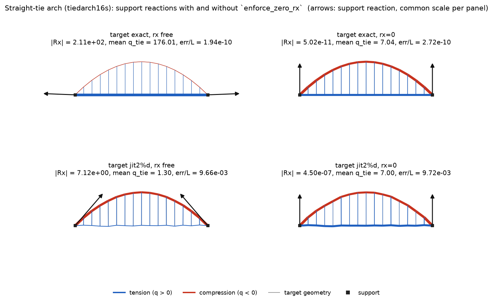

*Figure: `tiedarch16s`, exact (top) and jittered (bottom) targets, without
(left) and with (right) the zero-horizontal-reaction rows. Arrows are the
support reactions at a common scale within each panel; edge width ∝ member
force, so the thin arch on the top left is the 176-unit tie dominating.*

---

## 5. Sparsity and scaling

### 5.1 The dense trap (`warm_start_bench dense`)

The Gram normal equations `(EᵀE + λI) q = Eᵀp` are the naive inverse. `EᵀE`
is `ne × ne`; formed densely it is `8·ne²` bytes and `O(ne³)` to factor. The
same equations assembled sparsely have `nnz(EᵀE) ≈ 7·ne` on a quad mesh and
factor in near-linear time. Measured on corner-anchored quads:

| side | ne | dense bytes | dense ms | sparse ms | ratio | slope | ‖Δq‖/‖q‖ |
|---|---|---|---|---|---|---|---|
| 12 | 264 | 558 kB | 1.5 | 0.8 | 1.8 | – | 1.7e-14 |
| 16 | 480 | 1.8 MB | 8.7 | 1.1 | 7.7 | 2.97 | 7.9e-14 |
| 23 | 1 012 | 8.2 MB | 103.9 | 2.4 | 43 | 3.32 | 1.3e-13 |
| 32 | 1 984 | 31.5 MB | 784.0 | 4.7 | 168 | 3.00 | 8.9e-14 |
| 45 | 3 960 | 125.5 MB | 5 914 | 9.8 | 602 | 2.92 | 2.0e-13 |

The slope is the measured log–log exponent (3 = cubic). Extrapolating the
measured cubic, 150 k edges would need 180 GB for the dense Gram and about four
CPU-days to factor; the sparse LDL of the same system takes 0.32 s at 65 k
edges (Section 5.2). The two solutions agree to
`1e-13`, so the dense path buys nothing. (The `gram_dense` rows in the suite
are the same solver; the suite skips it above 6 000 edges.)

The pipeline never forms a product of sparse matrices: the saddle formulation
keeps `E`, `S` and `Λ` as separate blocks, so the fill of the LDL is that of
the augmented system, not of `EᵀS⁻ᵀS⁻¹E` (which would be dense).

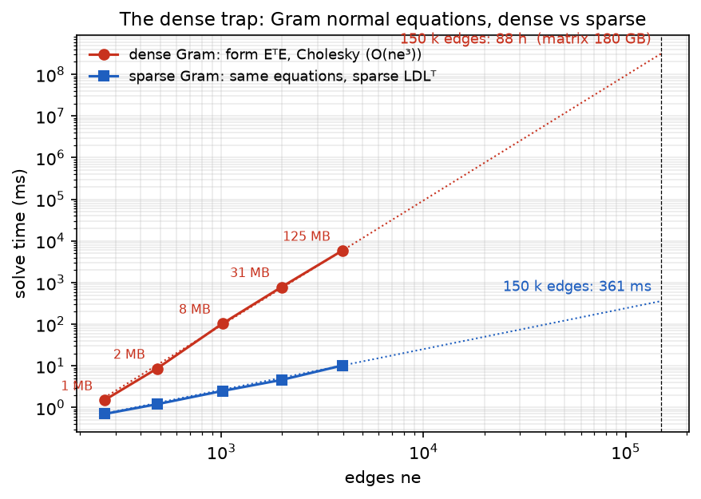

### 5.2 Warm-start cost against size (`warm_start_bench scale`)

Corner-anchored quads with jittered targets and the snug box; L-BFGS-B
(200 iterations) is run up to 16 k edges. `fac` is the number of numeric
factorisations of the Stage-2 saddle, `cap` the Stage-2 steps on which the
active set reached its pass limit.

Entries are `warm-start s / clipped start err/L / final err/L after 200
L-BFGS-B iterations / fac`.

| method | ne = 1 012 | ne = 4 140 | ne = 16 380 | ne = 65 160 |
|---|---|---|---|---|
| forward solve (ms) | 0.43 | 2.23 | 9.12 | 47.9 |
| L-BFGS-B evaluation (ms) | 0.63 | 1.85 | 9.81 | 60.5 |
| uniform | 0.00 s / 1.41 / 0.116 | 0.00 s / 3.28 / 0.209 | 0.00 s / 3.07 / 0.390 | 0.00 s / 9.13 / – |
| s1 | 0.02 s / 7.35 / 0.135 | 0.08 s / 21.7 / 0.274 | 0.42 s / 39.8 / 6.34 | 2.54 s / 101 / – |
| gram_sparse | 0.00 s / 22.8 / 0.124 | 0.01 s / 57 / 0.278 | 0.05 s / 90.3 / 0.485 | 0.32 s / 191 / – |
| gram_dense | 0.11 s / 22.8 / 0.131 | 6.64 s / 57 / 0.271 | skipped (> 6 000 edges) | skipped |
| length_ratio | 0.00 s / 0.257 / 0.0726 | 0.01 s / 1.61 / 0.154 | 0.04 s / 2.97 / 0.337 | 0.15 s / 9.13 / – |
| frozen | 0.14 s / 0.104 / 0.0726 / 17 | 0.95 s / 0.418 / 0.150 / 26 | 6.30 s / 2.31 / 0.350 / 32 | 33.3 s / 6.63 / – / 27 |
| **pipeline** | 0.36 s / 0.0753 / 0.0626 / 53 | 3.15 s / 0.301 / 0.135 / 96 | 18.8 s / 1.31 / 0.292 / 105 | 134 s / 4.28 / – / 118 (cap 1) |
| legacy (Clarabel Stage 2) | 0.32 s / 0.0753 / 0.0626 / 3 | 3.22 s / 0.282 / 0.134 / 3 | 55.8 s / 2.31 / 0.283 / 3 | 536 s / 18.6 / – / 3 |
| pipeline_noguard | 0.20 s / 0.0753 / 0.0626 / 29 | 1.48 s / 0.301 / 0.135 / 44 | 10.2 s / 3.38 / 0.296 / 54 | skipped (time budget) |

The `frozen` and `pipeline` rows are from the re-run after the seed guard was
changed to race both seeds through the whole of Stage 2 (Section 3.3); the
guard fires on these quads from 4 k edges up (`guard→u`), so those two rows
carry roughly twice the factorisations of the earlier single-branch run
(`pipeline_noguard`, measured before that change, shows the single-branch
cost). The other rows are unchanged within run-to-run noise.

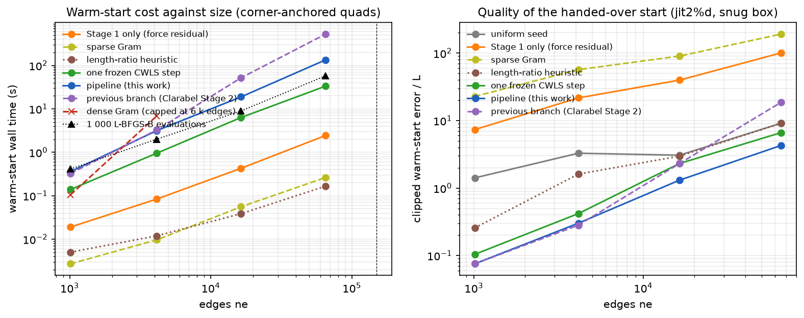

What the trend says:

* **Per-factorisation cost is near-linear.** The pipeline's time per numeric
  factorisation is 7 ms at 1 k edges, 33 ms at 4 k, 180 ms at 16 k and
  1.1 s at 65 k: a log–log slope of 1.1–1.3, as expected for a fill-reducing
  LDL of a 2-D mesh (`O(n^1.5)` worst case, closer to linear at these sizes). Stage 1 (interior point, `t`-form) scales the same way
  (0.02 → 2.4 s) and is 2 % of the total at 65 k.
* **The interior-point Stage 2 does not scale.** `legacy` costs the same as
  the pipeline at 1–4 k edges (three interior-point solves against ~100
  active-set factorisations, two seeds raced), 2.7× at 16 k and 3.9× at 65 k
  (nine minutes for three steps), and without the seed guard it returns a
  *worse* warm start than the uniform seed at 65 k (18.6 vs 9.1) because
  Stage 1 has collapsed (`s1e = 1.8e4`). Extrapolated to 150 k edges the
  pipeline is 5–6 minutes with the race, about half that with
  `seed_guard_margin = ∞` when the seed is trusted; the previous branch
  about half an hour.
* **The warm start pays for itself at every size that could be measured.**
  At 16 k edges the pipeline's 18.8 s equals ~2000 L-BFGS-B evaluations
  (the frozen step alone, 6.3 s, ~700); the start it hands over is 2.3×
  closer than the uniform seed and L-BFGS-B ends 25 % lower after 200
  iterations (0.292 vs 0.389). The naive seeds are
  worse than uniform at this size and beyond (`s1` 39.8, sparse Gram 90 vs
  3.07), and the sparse Gram clips nearly every edge to the box at 4 k edges
  and up.
* **Where the pipeline degrades.** At 65 k the number of active-set passes
  per step grows (13–19 at 16 k, 14–24 at 65 k), the second Gauss--Newton step
  reaches the pass limit (`cap 1`), and the returned step is the safeguarded
  partial step rather than the KKT point. In a run where that step was
  instead solved exactly by the interior point (180 s for the single step)
  the warm start was 1.70 instead of 4.28. This is open item 1 in Section 7.
  The frozen step alone (33 s, 6.63) is still 1.4× better than the uniform
  seed and 15× better than Stage 1.
* **Memory** is `O(nnz)` throughout: the saddle at 65 k edges has 2·98 k +
  65 k rows and about 2 M non-zeros before fill; the dense Gram that some
  reference implementations form would be 34 GB.

---

## 6. Related approaches and how they compare

| approach | what it solves | boxes | mixed sign / self-stress | cost per step | measured here |
|---|---|---|---|---|---|
| Schek 1974, force-density method (forward) | `x(q)` for given `q` | – | yes | 1 sparse Laplacian solve | the primitive everything else calls (`forward_solve`: 0.4 ms at 1 k edges, 53 ms at 65 k) |
| Uniform / hand-picked `q` (common practice; the start FDMremote, JAX FDM and this repository's own optimiser use) | nothing; a starting point | trivially | only if the pattern is right — and with equal magnitudes the Laplacian is singular on 4 of the 8 CEM structures (Section 6.1) | 0 | median 52× the optimum start; 13/64 suite cases end > 1.5× the optimum |
| Least-squares force residual on `E(x*)` (Schek's inverse, Block & Lachauer 2014 "best-fit TNA" in force-density form, Linkwitz) | `min ‖E(x*)q − p‖²` | with an interior point (our Stage 1) or unboxed + clip (Gram) | finds the self-stress pattern but not its magnitude | 1 sparse LS solve; ruinous when `EᵀE` is formed densely | 30–130× the optimum start; L-BFGS-B needs 600–900 evaluations to recover, cable dome never |
| Geometric least squares by Gauss–Newton / L-BFGS on `‖x(q) − x*‖²` (Van Mele & Block 2014 algebraic graph statics for the 2-D case; JAX FDM, Pastrana et al. 2023, for the general differentiable case) | the right objective | box via projection or `L-BFGS-B` | yes, given a start | 1 forward solve + adjoint per evaluation | this is the downstream optimiser; from a cold start it needs 100s–1000s of evaluations |
| Length-ratio update `q ← q·ℓ(q)/ℓ*` (practitioner heuristic, iterative TNA horizontal equilibrium) | a fixed-point form of the geometric problem | clip | no (diverges with compression) | 1 forward solve | 5× the optimum on shallow tension nets; diverges on the barrel, the tied arch, the dome |
| **Compliance-weighted LS + active set (this work)** | the geometric objective, linearised with its own metric | exact, active set on the sparse saddle | yes | 3–5 numeric LDLs per step (one symbolic) | within 2 % of the optimum on 64/64 before L-BFGS-B; 19 s at 16 k edges (two seeds raced) vs 52 s for the interior-point variant |

A controlled comparison of those three-to-five saddle solves against a
short L-BFGS-B run on the exact geometric objective — starting from the
same Stage-1 `q*`, with the seed guard off — is in
[`gn_vs_lbfgs.md`](gn_vs_lbfgs.md). Ten accepted L-BFGS-B steps saturate
the compact history (`m = 10`) but do not invert the compliance-weighted
Gramian; the experiment reports force, geometric and gradient residuals
at every budget.

Two remarks for the paper:

* The frozen CWLS step is *exactly* Schek's least-squares inverse with the
  norm changed from `I` to `D(q)⁻²`. Everything the geometric metric buys is
  in that change of norm; Section 2 gives the one-line derivation.
* The active-set Stage 2 is a bounded-variable least-squares solver (Stark &
  Parker BVLS; Hintermüller–Ito–Kunisch primal–dual active set) specialised to
  a sparse saddle with a reusable symbolic factorisation and a monotone
  safeguard on the QP objective. Its role is to make the box exact without an
  interior point; the interior point remains selectable.

### 6.1 Head-to-head on published case studies (`warm_start_bench external`)

The synthetic suite has known funiculars by construction. To test the pipeline
on structures somebody else designed, the two open-source mixed-sign
implementations were run on their own bundled examples and the results
exported as case files (`bench/external/`, one JSON per structure, produced
by `export_jax_fdm.py` and `export_compas_cem.py` under `uv`):

* **JAX FDM** (Pastrana, Oktay, Adriaenssens, Adams 2023; `jax_fdm 0.14.1`,
  upstream `9a17fd3`): every example that poses an inverse problem — arch
  (load path; reaction direction), prestressed cable net, creased shell, dome,
  grid-shell planarisation, monkey saddle, pillow, pringle, and the one
  mixed-sign example upstream, `truss_equal_force` (compression top chord,
  tension bottom chord, compression struts: a tied truss). The example's own
  optimisation is run first; its optimised force densities `q_ref` and the
  resulting geometry become the case. JAX FDM is then run a second time on
  exactly our problem — SciPy L-BFGS-B (`jax_fdm.optimization.LBFGSB`,
  `ftol = gtol = 1e-10`, 1000 iterations), `NodePointGoal` on every free node,
  the example's own box, seeded with `sign · median|q_ref|` — and that run is
  the `ext:jax_fdm` row (wall time excludes JIT compilation).
* **compas_cem** (Pastrana; `0.8.6`, upstream `0964b76`, `nlopt 2.7.1`): the
  Python examples (braced tower, suspension bridge, tree, 16-side tensegrity
  wheel) and the three CAD 2023 paper structures that exist outside
  Grasshopper — the 64-side tensegrity wheel, the 3-D tree canopy, and the
  curved bridge under torsion with 10 and 22 hangers. CEM's constrained
  optimisation (SLSQP / L-BFGS via nlopt with autograd gradients) is run as
  published; the optimised trail and deviation forces divided by member lengths
  give `q_ref`. Every export is verified independently in NumPy to be an FDM
  equilibrium (free-node residual ≤ 3e-14, re-solve ≤ 3e-11 relative) and
  again by Theseus' forward solve at load time. Self-stressed wheels have no
  supports in CEM, so three well-spread rim nodes are fixed; CEM's auxiliary
  trails that ended at exactly zero force are dropped, the others become
  ordinary members with `|q| ≈ 1e-5` — which is why those matrices have
  condition numbers of 1e5–1e7 and why the loose box there spans seven
  decades.

Every case is run three ways: the **exact** target (the reference geometry,
so a `q` inside the box reproduces it), a **jittered** target (white noise of
1 % of the bounding-box diagonal on every free coordinate, capped at a fifth
of the shortest member), and, where the example fitted a designer's surface,
that **designer** target. Rows: the seven suite methods, uniform seeds at
×0.1, ×1, ×10 and a ±¼-decade randomised uniform, the pipeline, an *oracle*
started at `q_ref`, and the external tool's own run. Errors are `‖x − x*‖/L`;
"its" are L-BFGS-B iterations (cap 1000); the pipeline's ms include Stage 1.
Full tables: `bench/external/results/rust_external_run.txt`; per-case JSON
next to it.

| case | target | n_e | T/C | uniform: warm → final (its) | pipeline: ms, warm → final (its) | JAX FDM L-BFGS-B: its / ms / final | oracle final |
|---|---|---|---|---|---|---|---|
| jax truss_equal_force | exact | 32 | 11/21 | 17 → **0.24 (59, stuck)** | 2 ms, 1.8e-7 → 1.8e-7 (0) | 54 / 81 / **0.26 (stuck)** | 1.8e-15 |
| jax truss_equal_force | jit 1 % | 32 | 11/21 | 17 → 0.060 (1000) | 2 ms, 0.028 → 0.028 (210) | – | 0.028 |
| jax cablenet (prestress only) | exact | 220 | 220/0 | 1.4 → 0.023 (1000) | 7 ms, 7.8e-9 → 7.8e-9 (0) | 462 / 584 / **0.085** | 8e-15 |
| jax cablenet | jit 1 % | 220 | 220/0 | 1.4 → 0.072 (1000) | 25 ms, 0.26 → 0.068 (1000) | – | 0.068 |
| jax creased_shell | exact | 324 | 0/324 | 1.2 → 3.1e-5 (1000) | 11 ms, 2.3e-12 → 2.3e-12 (0) | 1000 / 1339 / 2.8e-5 | 3e-15 |
| jax creased_shell | designer surface | 324 | 0/324 | 1.2 → 0.0687 (1000) | 24 ms, 0.078 → 0.0687 (1000) | – | 0.0687 |
| jax dome | exact | 480 | 0/480 | 68 → 3.6e-3 (1000) | 31 ms, 8.8e-9 → 8.8e-9 (0) | 1000 / 1389 / 6.4e-3 | 2e-14 |
| jax dome | jit 0.34 % | 480 | 0/480 | 68 → 0.040 (1000) | 95 ms, 0.042 → 0.037 (1000) | – | 0.039 |
| jax monkey_saddle | exact | 216 | 0/216 | 0.74 → 9.2e-8 (231) | 4 ms, 4.3e-11 → 4.3e-11 (0) | 202 / 1003 / 7.9e-7 | 9e-16 |
| jax monkey_saddle | jit 0.43 % | 216 | 0/216 | 0.74 → 0.0227 (270) | 7 ms, 0.0227 → 0.0227 (120) | – | 0.0227 |
| jax pillow | exact | 144 | 0/144 | 0.20 → 6.8e-7 (209) | 2 ms, 1.1e-11 → 1.1e-11 (0) | 179 / 349 / 2.3e-6 | 3e-15 |
| jax pringle | exact | 161 | 0/161 | 2.5 → 1.0e-6 (756) | 5 ms, 5.3e-11 → 5.3e-11 (0) | 624 / 632 / 1.1e-5 | 8e-16 |
| jax gridshell_planarization | exact | 144 | 0/144 | 1.6 → 4.6e-7 (341) | 3 ms, 1.1e-10 → 1.1e-10 (0) | 272 / 664 / 2.2e-6 | 2e-15 |
| cem braced_tower_2d | exact | 9 | 3/6 | **singular Laplacian** | 0.4 ms, 3.2e-9 → 1.8e-9 (1) | – | 1e-15 |
| cem tree_2d | exact | 4 | 1/3 | **singular Laplacian** | 0.2 ms, 5.4e-9 → 1.1e-9 (1) | – | 2e-17 |
| cem tensegrity_wheel_2d | exact | 24 | 16/8 | **singular Laplacian** | 1 ms, 1.8e-15 (0) | – | 3e-15 |
| cem tensegrity_wheel_2d | jit 1 % | 24 | 16/8 | singular | 2 ms, 0.0227 → 0.0227 (92) | – | 0.0227 |
| cem tensegrity_wheel_64 (paper) | exact | 96 | 64/32 | 8.1 → **1.44 (1000)** | 4 ms, 2.7e-14 (0) | – | 3e-14 |
| cem tensegrity_wheel_64 (paper) | jit 0.69 % | 96 | 64/32 | 8.1 → 1.74 (1000) | 10 ms, 0.041 → 0.037 (114) | – | 0.049 |
| cem tree_canopy_3d (paper) | exact | 144 | 48/96 | **singular Laplacian** | 6 ms, 3.7e-11 → 2.9e-9 (1) | – | 3e-9 |
| cem tree_canopy_3d (paper) | jit 0.55 % | 144 | 48/96 | singular | 9 ms, 0.025 → 0.015 (1000) | – | 0.026 |
| cem curved_bridge_10 (paper) | exact | 58 | 19/39 | 0.54 → **0.13 (1000)** | 3 ms, 4.9e-7 (1) | – | 3.4e-6 |
| cem curved_bridge_10 (paper) | jit 1 % | 58 | 19/39 | 0.55 → 0.14 (1000) | 4 ms, 0.23 → 0.082 (1000) | – | 0.042 |
| cem curved_bridge_22 (paper) | exact | 130 | 45/85 | 1.0 → **0.35 (1000)** | 6 ms, 1.1e-7 (1) | – | 2.3e-7 |
| cem curved_bridge_22 (paper) | jit 0.85 % | 130 | 45/85 | 1.0 → 0.45 (1000) | 16 ms, 1.8 → 0.23 (1000) | – | 0.054 |
| cem bridge_2d | exact | 9 | 8/1 | 2.9 → 6.6e-9 (67) | 0.6 ms, 3.9e-9 (1) | – | 2e-11 |

What the table says:

1. **On every exact target the pipeline returns the answer** (1e-7 to 1e-15
   of L) in 0.2–31 ms with no L-BFGS-B iterations, on all 18 structures
   including the eight mixed-sign ones. JAX FDM's L-BFGS-B from the same
   uniform seed needs 179–1000 iterations (0.35–1.4 s of solver time) on the
   compression shells and reaches 8e-7–6e-3; our own L-BFGS-B from the same
   seed needs 209–1000, so this is the seed, not the optimiser or the
   language. (SciPy's `ftol` is relative to `max(|f|, 1)`, so with a loss
   heading to zero JAX FDM's public `tol = 1e-10` is an absolute stop of
   1e-10 on the squared loss, i.e. a floor of ≈ 3e-5 L on the fit; its
   "converged" finals sit there, not at machine precision.)
2. **Mixed sign is where cold starts fail outright.** On Pastrana's tied
   truss both L-BFGS-B implementations stall at 0.24–0.26 L from the median
   seed (SciPy: "relative reduction of f ≤ factr·epsmch"); the ×0.1 seed
   converges (118 iterations here, 99 in JAX FDM), the ×10 seed stalls at
   0.10–0.40 L. On four of the eight CEM structures the equal-magnitude sign
   seed has a *singular* Laplacian: wherever tension and compression members
   of equal |q| balance at a node the diagonal `Σ q_e` is zero, so an unpivoted
   LDLᵀ meets a zero pivot (a pivoted solver would proceed to an arbitrary,
   far-away geometry). On the 64-side wheel and both curved bridges the seed
   is not singular but L-BFGS-B ends at 0.13–1.4 L after 1000 iterations. The
   pipeline does not see any of this: Stage 1 fixes the sign *ratios* from
   the force residual, and the compliance-weighted steps do the rest.
3. **Prestress-only nets** (the cable net: all loads zero) are a
   pure self-stress problem: geometry depends only on ratios of `q`. Gram
   returns `q = 0` (NaN), JAX FDM stops at 0.085 L on a projected-gradient
   test, and the pipeline lands at 7.8e-9 L in 7 ms.
4. **Jittered targets on the CEM bridges are hard for everyone.** The
   Stage-1 force residual explodes (a near-mechanism deck), the warm start is
   0.23–1.8 L, and L-BFGS-B ends 2–4× above the oracle's basin (0.082 vs
   0.042; 0.23 vs 0.054). These are the honest failures in the set; they are
   also the cases that drove the guard race and the degenerate-linearisation
   fallback of Sections 3.3 and 3.6. Without those, the pipeline ended at
   0.34 and 0.58 L.
5. **Where the target is not exactly reachable** (jitter, designer surface),
   the pipeline's warm start is within 1–13 % of the final L-BFGS-B optimum
   on every JAX FDM shell, and the evaluations to reach 1.05× the optimum
   drop from 38–364 for the uniform seed to 0–13 (`ev<1.05b` column of the
   full tables) — except the jittered dome, where the uniform seed never
   gets within 5 % in 1000 iterations and the pipeline start needs 258. The
   1000-iteration final values coincide because L-BFGS-B polishes from either
   start; the warm start buys the first two orders of magnitude.
6. **Cost.** The external tool's solve time is 20–100× our L-BFGS-B's for the
   same iteration count (JAX on CPU vs Rust with a cached symbolic
   factorisation); the comparison that matters is iterations, which agree
   within 25 % from equal seeds (ours stops later on its tighter tolerance). The pipeline's own cost is 2–31 ms on these
   sizes, i.e. 5–40 L-BFGS-B iterations' worth.

CEM itself is not an FDM competitor on the same objective: it parameterises
trail lengths and deviation forces, not force densities, and its published
optimisations here are goal-driven (edge-force targets, point and line goals)
rather than shape fits; the published runs took 0.1–8 s (SLSQP, 32–153
evaluations) and are recorded in the case files for context. What the CEM
structures contribute is the mixed-sign, near-mechanism topologies —
tensegrity wheels, a torsion bridge, a tree canopy — that neither the
synthetic suite nor JAX FDM's examples contain.

### 6.2 Placing the work

* **Lineage.** This is the successor to *FDMremote* (Burke, Lee, Echelman,
  Feldman, Mueller, IASS 2023) and the *In Tension* thesis: differentiable FDM
  with hand-coded adjoints, box-constrained L-BFGS-B on composable objectives,
  a Grasshopper front end (Ariadne) and a Rust solver (Theseus). Those works
  start the optimiser from a uniform or user-drawn `q`; the contribution here
  is the start itself, and Section 6.1 measures it against exactly that
  baseline in two independent codes.
* **Closest prior art on the mathematics** is Cuvilliers' thesis (MIT 2020,
  Mueller group): closest-fit force-density fitting with analytical gradients
  and Hessians, solved with SQP; and, in the thrust-network setting, Block &
  Lachauer's best-fit TNA and Van Mele & Block's algebraic graph statics. None
  of them uses the compliance-weighted norm or an active-set treatment of the
  box, and none reports mixed-sign or self-stressed cases.
* **Mixed-sign FDM in Pastrana's work** appears in three places: the JAX FDM
  paper (ICML DAE 2023) shows `q` sampled in `[−1, −0.1]` next to `q = 1`
  (Fig. 3) and a tensegrity tower (Fig. 5), and the repository ships the tied
  truss above; the *Constrained form-finding of tension–compression
  structures using automatic differentiation* paper (CAD 2023) does mixed
  sign natively but through CEM, not FDM; and the IASS 2024 coupling paper
  with Adriaenssens routes the tension cable net through FDM and the
  compression deck through CEM — a split that is itself a statement about how
  comfortable mixed-sign FDM was. In all three the FDM optimiser is seeded by
  hand with the right signs and, where a box is used, it is one-signed per
  edge; none of them addresses the singular-seed and multi-basin behaviour
  that Section 6.1 measures.
* **Other constrained form-finding tools** (the Grasshopper SQP tool of the
  IASS 2024 "practical applications" paper, Miki & Kawaguchi's extended FDM,
  Marmo & Rosati's TNA reformulation) fit `q` and `x` jointly with a weak
  least-squares prior; they are the right comparison for the *objective*
  design, not for the warm start, and are not benchmarked here.

---

## 7. Recommendations and open items

**Use as default**

1. `Stage2Method::ActiveSet`, `seed_guard_margin = 3`, `lm_damping = 0`,
   `nondimensionalize = true`, `reaction_weight = 1`, one frozen and two
   Gauss--Newton steps. This is `InverseFdmOptions::default()` on this branch.
2. Hand L-BFGS-B the pipeline's `q` clipped to its box; on the suite this is
   within 2 % of what L-BFGS-B reaches after 1000 iterations, so the
   downstream budget can be cut to a few hundred evaluations or used for a
   tighter tolerance.
3. Turn on `enforce_zero_rx/ry` for pin–pin systems whose tie force is a
   self-stress mode (tied arches, spoked wheels with a tie). Check
   `InverseDiagnostics::reaction_residual`; a value of order the load means
   the request is inconsistent with the box.

**Open items, in order of value**

1. **Active-set passes on very large loose-box problems.** At 65 k edges the
   primal–dual sweep cycles on the Gauss--Newton steps (thousands of status
   changes per pass) and the pass limit returns a partial step (Section 5.2,
   `cap`). The monotone safeguard keeps it a descent step and the cost linear,
   but the exact QP solution (interior point, 180 s per step at this size)
   gives a warm start 2.5× closer. Candidates: an ε-active projected Newton
   with a diagonal scaling on the near-bound set (Bertsekas), a
   gradient-projection polish of the returned iterate (matrix-free, using the
   cached compliance), or a size-capped interior-point fallback.
2. **Adaptive step budget at scale.** On the 16 k and 65 k quads the two
   Gauss--Newton steps cost three times the frozen step and improve the start
   by 1.8× and 1.5×; whether the second step pays for itself is not measured
   separately. A stopping rule on the merit decrease (`|Δmerit| < 0.1·merit`)
   would make the default budget adaptive.
3. **Rejection-triggered Marquardt damping.** The ablation shows `λ_LM = 1e-4`
   helping the deep quads and hurting the self-stressed nets; a hybrid that
   damps only after a rejected undamped step is the natural compromise, but on
   the current suite the undamped steps are accepted, so a different trigger
   (e.g. a large predicted-vs-actual reduction ratio) is needed.
4. **Stage 1 at scale.** The Clarabel Stage 1 is 2.5 s of the 65 k warm start
   and grows faster than the active-set steps; with the guard in place a
   uniform sign seed is competitive on single-sign nets, so Stage 1 could be
   skipped when the box fixes the sign of every edge and no reaction rows are
   enforced.
5. **Benchmarks on real projects.** The synthetic suite and the 18 published
   case studies of Section 6.1 all have a known feasible `q`; only the
   creased-shell designer surface is a genuinely unreachable target. The
   `warm_start_bench external` harness takes any structure as a JSON case
   file; one or two measured or designed targets from practice (an Echelman
   net, a built shell) would close this gap.
6. **Jittered near-mechanism mixed-sign targets.** On the CEM curved bridges
   the pipeline ends 2–4× above the basin an oracle reaches (Section 6.1).
   The Stage-1 seed is what limits it there; candidates are a Stage 1 in the
   compliance-weighted norm of the uniform seed, or several Stage-2 restarts
   from the seed sweep with the best final error kept.
